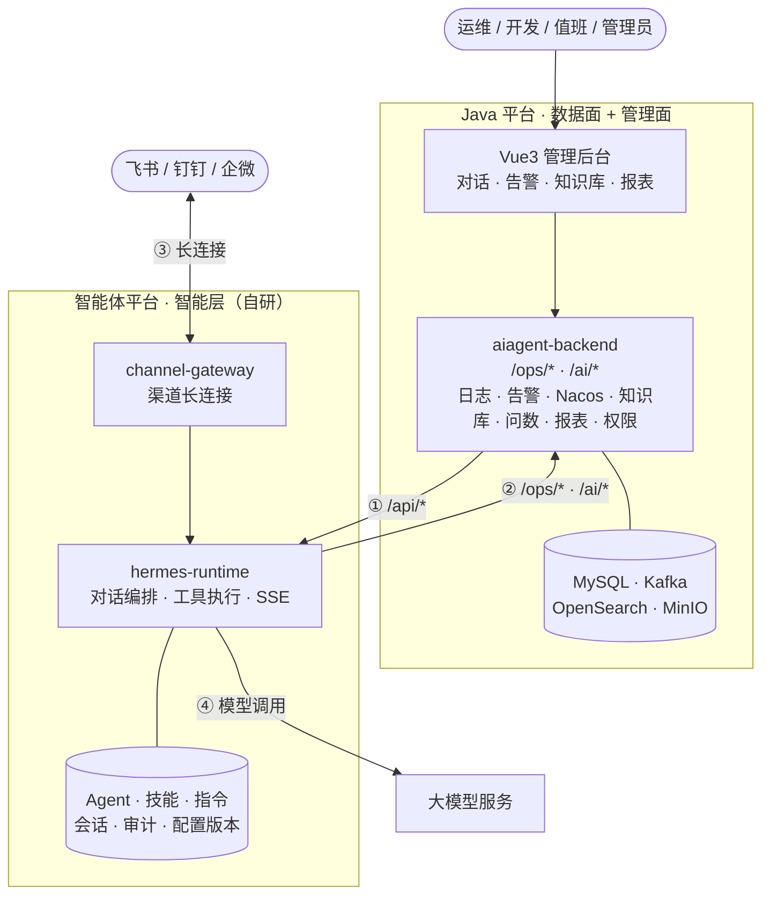
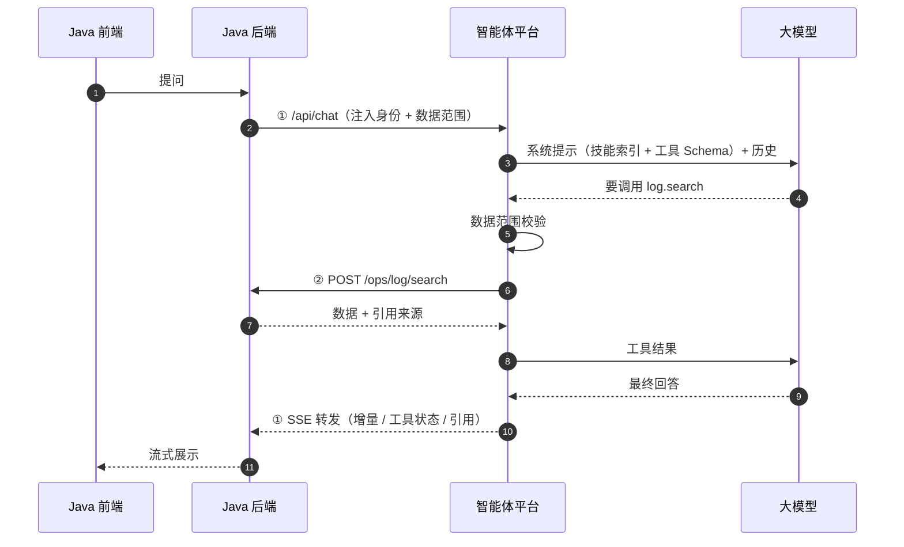
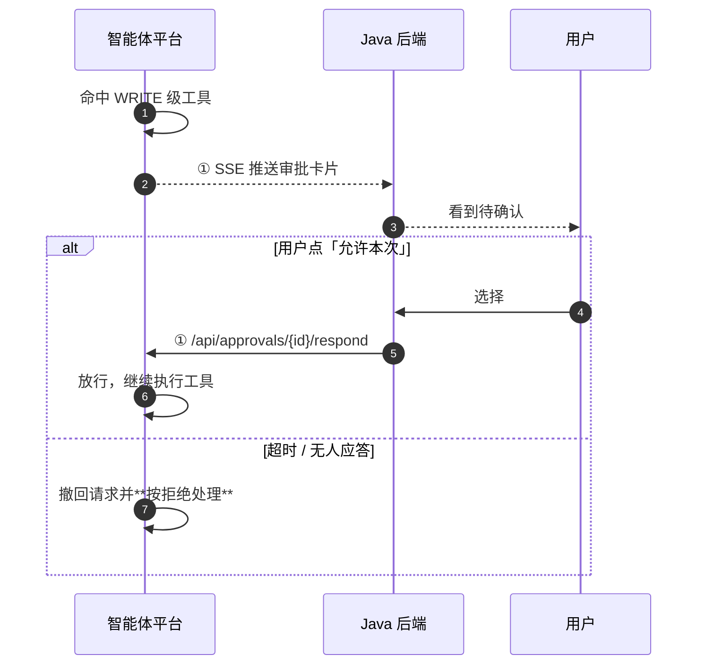

# HERMES 智能运维平台 · 方案概览（自研智能体）

> **5 分钟版。** 本文只讲「是什么、怎么连、谁做什么」；细节见本目录其余两份文档。
> 状态：草案 · 2026-09-29

---

## 1. 一句话

**Java 平台管数据和界面，智能体平台管智能，两边用一份接口契约对接，智能体运行时由我们自己实现。**

要解决的事（详见《HERMES 智能运维平台完整解决方案》，下称"原方案"）：日志、告警、Nacos 变更、运维知识库、智能问数、健康报表——全部通过**受控工具**交给大模型，而不是让模型直接碰生产系统。

**与原方案的关系**：原方案是 Java 平台侧的权威文档，本文档集补它没展开的**智能体平台**部分与**两边对接**。

---

## 2. 全景架构

**四条跨边界连线**：

| # | 方向 | 说明 |
|---|---|---|
| ① | Java 后端 → 智能体平台 | 管理面 `/api/*`：发消息、审批应答、Agent/技能/渠道配置、会话查询 |
| ② | 智能体平台 → Java 后端 | 工具面回头调数据：`/ops/*`、`/ai/*` |
| ③ | 渠道平台 ↔ 智能体平台 | 飞书/钉钉/企微长连接，**双向**（区别于原方案 §8 的单向通知） |
| ④ | 智能体平台 → 大模型服务 | 出站 HTTPS，模型与生产数据源之间**没有直连** |

> **没画的一条线**：模型 ↔ 生产数据源——**不存在**，只能经 ② 绕一圈。
> **前端不是我们的交付物**：用户界面由 Java 的 Vue 应用承载。

---

## 3. 一次问答的链路

**关键点**：模型看到的只有工具，看不到平台凭据；`/ops/*` 的调用由智能体平台发起，**身份和范围由 Java 侧注入并在服务端复核**。

---

## 4. 写操作要人工确认

只读工具直接执行；**写操作（确认告警、解决告警、静默、发通知、出报表）必须由人点过才生效**。

选项：**允许一次 / 允许本次会话 / 始终允许 / 拒绝**。超时一律按**拒绝**处理（fail-closed）。

---

## 5. 渠道（飞书）

人在飞书里 @ 机器人提问，机器人调工具回答。**这与原方案 §8 的通知中心是两条不同的路径**：

| | 通知中心（原方案 §8） | 渠道适配器（本方案） |
|---|---|---|
| 方向 | 单向推送 | **双向对话** |
| 连接 | 无长连接，HTTP 发完即走 | **独占长连接**，常驻 |
| 部署 | 无状态 | **有状态**（`channel-gateway`） |
| 身份 | 无 | **需渠道用户 ↔ 平台用户映射** |

**共用渠道凭据，不共享连接**——否则通知量一大就会把对话连接拖死。详见《智能体平台设计》§9。

---

## 6. 谁做什么

| 方 | 负责 | 不负责 |
|---|---|---|
| **Java 平台** | 数据面（日志 / 告警 / Nacos / 知识库 / 问数 / 报表）+ 管理后台 + 用户权限 + 通知中心 | 不做智能体运行时 |
| **智能体平台**（自研） | 对话编排、14 个受控工具、审批、审计、Agent/技能/指令配置、渠道对话接入 | 不碰生产数据源、不做业务页面 |
| **大模型服务** | 语言理解与生成 | 不直连任何生产系统 |

---

## 7. 文档地图

| 文档 | 写什么 | 读者 |
|---|---|---|
| **`00-overview.md`（本文）** | 5 分钟看懂整体方案 | **所有人先读这份** |
| `interface-contract.md` | **两边怎么对接**：双向 API、工具映射、渠道归属、网络认证、数据归属 | **双方评审** |
| `agent-platform.md` | 智能体平台怎么实现：运行时、工具、技能、指令、Agent、渠道、热更新 | 我们 |
| 《HERMES 智能运维平台完整解决方案》 | Java 平台侧：日志 / 告警 / Nacos / 知识库 / 报表 / 权限 | Java 团队（**外部权威文档**） |

**纪律**：同一件事只出现在一份文档里，其他地方引用，不复制。**冲突时以《接口契约》为准**；Java 平台内部事项以**原方案**为准。

---

## 8. 八条关键设计决策

| # | 决策 | 一句话理由 |
|---|---|---|
| 1 | **智能体运行时自己实现** | 全栈 Java 一套技术栈，不受上游版本漂移影响 |
| 2 | **参考开源 Hermes 的设计，不引入依赖** | 技能格式、渐进披露、斜杠指令、审批粒度都是被验证过的（详见《智能体平台设计》§1） |
| 3 | **前端在 Java 侧** | 我们只提供 API |
| 4 | **工具优先** | 模型只能通过 14 个受控工具访问数据，不直连生产系统 |
| 5 | **权限前置、模型无权决定** | 身份由 Java 注入；数据范围在服务端校验，**工具执行层才是权威** |
| 6 | **默认只读** | 写操作必须人工审批；不可逆动作（如关闭告警）**根本不给工具** |
| 7 | **有证据回答** | 查询接口必须返回 `citations`，回答引用来源 |
| 8 | **配置全在库里，运行时无状态** | 改配置不重启，版本号对账自动生效（详见《智能体平台设计》§10） |

---

## 9. 分期

**智能体平台侧**：

| 期 | 内容 | 依赖 |
|---|---|---|
| 一 | 运行时骨架：Chat API + SSE、会话、Tool Registry/Executor、内置指令、配置中心、审计 | **不依赖 Java 侧** |
| 二 | 14 个工具接真实 `/ops/*` `/ai/*`、审批闭环、数据范围校验 | 等 Java 接口就绪 |
| 三 | Agent 配置与版本化、技能系统、指令捆绑包、模型接入 | 一期 |
| 四 | 渠道对接（飞书一期范围）、身份映射、渠道管理后台 | 三期 |
| 五 | MCP 扩展位、记忆与上下文压缩、生产强化 | 全部 |

**Java 平台侧**按原方案 §22 分六阶段，**问答排在第四阶段**——两边按阶段分批联调。

---

## 10. 前提与当前未决

**前提**：智能体平台自研，**不引入开源 Hermes 作为运行时依赖**。若改为封装现成运行时，本目录的《智能体平台设计》需重做（《接口契约》不受影响）。

**阻塞项**（详见《接口契约》§9 与《智能体平台设计》§17）：

- `database_metric_query` / `notification_send` 两个工具**在 Java 侧还没有对应接口**
- 报表生成**同步还是异步**（工具默认 10s 超时不够）
- 会话归属：Java 侧**建不建**本地索引表
- **飞书渠道一期范围**——是否只需要文本 + 卡片

**不阻塞但越早越好**：服务命名、模型 provider 选型、traceId 格式、渠道身份配对策略。
