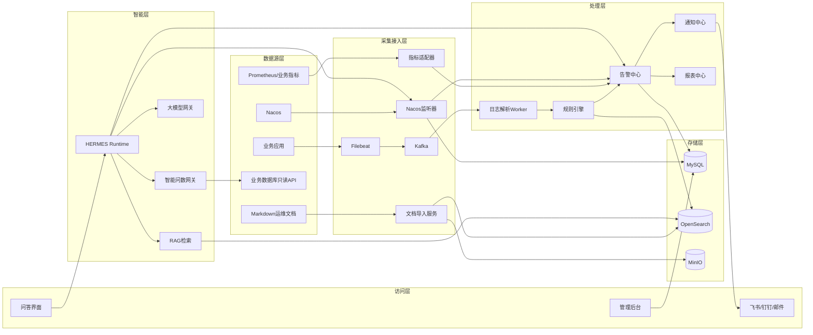
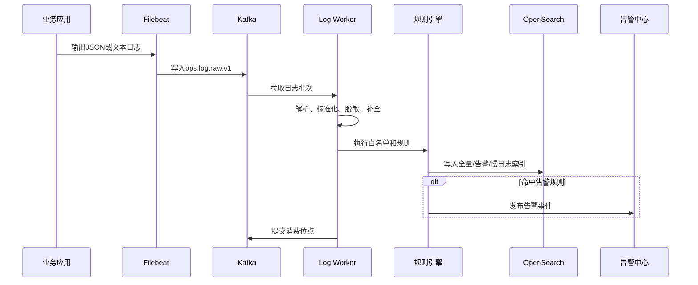
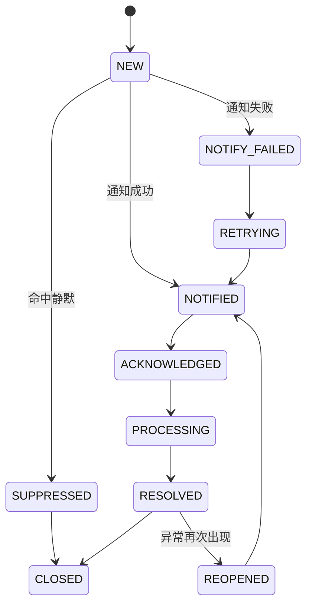

# HERMES 智能运维平台完整解决方案

## 1. 文档概述

### 1.1 目的
本文档用于指导 HERMES 智能运维平台的架构设计、模块拆分、接口设计、数据设计、部署建设、测试验收和阶段性交付。
方案以现有 `agent-platform` 为管理控制面，围绕日志分析、告警闭环、Nacos 变更监控、运维知识库、智能问数和大模型问答进行建设。

### 1.2 建设范围
- 应用日志采集、解析、检索和生命周期管理。
- 日志告警、业务指标告警和慢日志告警。
- 告警去重、聚合、静默、升级、恢复和关闭。
- 飞书、钉钉、邮件通知。
- Nacos 配置变更和服务实例变更监控。
- Markdown 运维知识库和 RAG 检索。
- 基于只读数据 API 的智能问数。
- HERMES 对话、Agent 编排、工具调用和审计。
- 两小时健康报表和人工范围报表。
- 平台监控、安全、权限和审计。

### 1.3 非建设范围
本期明确不包含：
- 代码托管平台管理。
- Git 代码仓库同步、定时拉取和本地代码仓。
- 提交、分支和代码 Diff 查询。
- 代码评审 Agent、评审任务及评审报告。
- 日志异常与代码变更关联分析。
现有项目中的代码仓库与代码评审功能可以继续独立运行，但不接入本期 HERMES 数据源、工具体系和实施计划。

### 1.4 目标用户
运维工程师、应用开发人员、系统负责人、值班人员、平台管理员及审计人员。

## 2. 建设目标

### 2.1 业务目标
- 建立统一日志接入、查询和告警平台。
- 建立从发现、通知、确认、处理到恢复的告警闭环。
- 关联异常前后的 Nacos 配置和服务实例变化。
- 建立结构化、可检索、带权限的运维知识库。
- 支持自然语言查询系统健康、告警和运行指标。
- 通过 HERMES 汇总证据并给出原因和处理建议。
- 自动生成周期性系统健康报表。

### 2.2 技术目标
- 控制面与高吞吐日志处理解耦。
- 支持横向扩展、故障恢复、幂等、重试和死信。
- 日志正文与业务元数据分库存储。
- 大模型只能通过受控工具访问数据。
- 配置、规则和 Agent 支持版本化和回滚。
- 关键链路具备指标、日志和调用链监控。

### 2.3 初始服务目标
| 指标 | 初始目标 |
|---|---|
| 平台可用性 | ≥99.9% |
| 日志可检索延迟 | P95＜10秒 |
| P0/P1告警生成延迟 | P95＜30秒 |
| 通知成功率 | ≥99% |
| 重复建告警比例 | ＜0.1% |
| HERMES普通问答首字延迟 | P95＜5秒 |
| 有证据回答占比 | 100% |
最终指标需要结合真实日志量和基础设施压测确认。

## 3. 架构原则
1. 控制面与数据面分离：`agent-platform` 管理配置，高吞吐日志由独立 Worker 处理。
2. 事件驱动：日志、告警、通知和 Nacos 变更通过 Kafka 解耦。
3. 日志不入业务库：正文进入 OpenSearch，MySQL 只保存元数据和状态。
4. 至少一次投递、消费端幂等：降低全链路 Exactly Once 的复杂度。
5. 工具优先：HERMES 通过受控工具访问数据，不直接连接生产系统。
6. 权限前置：在查询和检索阶段完成权限及数据范围过滤。
7. 有证据回答：回答必须引用日志、告警、配置或文档来源。
8. 配置化策略：保留周期、告警阈值和通知对象不得硬编码。
9. 模块化演进：初期保持有限部署单元，负载增长后再拆分。
10. 默认只读：生产变更类动作本期禁止或必须人工确认。

## 4. 总体架构

### 4.1 逻辑架构


### 4.2 部署单元
| 单元 | 职责 | 扩容方式 |
|---|---|---|
| `aiagent-web` | 管理、告警、知识库、报表和问答界面 | 无状态扩容 |
| `aiagent-backend` | RBAC、规则、告警、文档、报表控制面 API | 无状态扩容 |
| `hermes-runtime` | 对话编排、工具执行、RAG、大模型访问 | 无状态扩容 |
| `log-worker` | Kafka消费、解析、规则判断和索引写入 | 按Kafka分区扩容 |
| `scheduler-worker` | 报表、补偿、清理审计和Nacos对账 | 多实例分布式锁 |
初期可将定时任务放入后端，但必须使用分布式锁。

### 4.3 基础设施
- MySQL：规则、告警、Nacos变更、知识元数据、会话和审计。
- Kafka：日志及业务事件总线。
- OpenSearch：日志检索、聚合分析和知识向量检索。
- MinIO：Markdown原文、附件和报表文件。
- Nacos：运行配置和服务注册数据源。
- Prometheus/Grafana：指标与看板。
- OpenTelemetry：跨服务调用链。

## 5. 核心业务流程

### 5.1 日志采集

原则：索引和告警处理成功后提交位点；单条失败进入死信；使用 `eventId` 保证幂等；Kafka原始日志保留24～72小时用于重放。

### 5.2 告警状态机


### 5.3 Nacos变更
```text
Nacos实时监听
→ 计算配置Hash或实例差异
→ 保存快照和脱敏Diff
→ 发布ops.nacos.change.v1
→ 规则引擎判断
→ 告警或仅记录
→ HERMES按故障时间窗口查询
```
实时监听负责低延迟，周期对账负责发现丢失事件。

### 5.4 HERMES问答
```text
用户问题
→ 身份和数据范围校验
→ 意图识别
→ 生成受控执行计划
→ 调用日志/告警/Nacos/知识/指标工具
→ 汇总证据
→ 大模型分析
→ 安全和引用校验
→ SSE流式返回
→ 保存会话及工具审计
```

### 5.5 健康报表
```text
定时或人工触发
→ 聚合日志、告警、指标、Nacos变更
→ 计算健康指标
→ HERMES生成摘要
→ 生成Markdown/HTML/Excel
→ 保存MinIO
→ 按订阅发送通知
```

## 6. 日志中心设计

### 6.1 日志源配置
- 项目或系统、服务、环境、实例。
- 日志格式、字符集、时区。
- 解析模板和脱敏规则。
- 保留策略、负责人和告警接收组。

### 6.2 标准日志模型
```json
{
  "schemaVersion": "1.0",
  "eventId": "01JXXXX",
  "timestamp": "ISO-8601时间",
  "ingestTimestamp": "ISO-8601时间",
  "environment": "prod",
  "projectCode": "payment",
  "serviceName": "payment-service",
  "instanceId": "payment-service-01",
  "host": "10.0.0.10",
  "level": "ERROR",
  "logger": "com.example.PaymentService",
  "traceId": "trace-id",
  "spanId": "span-id",
  "message": "支付请求失败",
  "exceptionType": "TimeoutException",
  "durationMs": 1500,
  "httpStatus": 500,
  "labels": {},
  "rawData": "原始日志"
}
```

### 6.3 解析能力
- JSON字段映射、Grok或正则模板。
- Java异常堆栈多行合并。
- 时间、时区和字段类型转换。
- TraceId、服务、环境信息补全。
- Token、手机号、身份证等敏感字段脱敏。
- 模板在线测试、失败样本查看和死信重放。

### 6.4 Kafka Topic
| Topic | 用途 | 建议保留 |
|---|---|---|
| `ops.log.raw.v1` | 原始日志 | 24～72小时 |
| `ops.log.normalized.v1` | 标准化日志，可选 | 24小时 |
| `ops.alert.event.v1` | 告警事件 | 7天 |
| `ops.notification.command.v1` | 通知命令 | 3天 |
| `ops.nacos.change.v1` | Nacos变更 | 7天 |
| `ops.dead-letter.v1` | 失败消息 | 7～30天 |
分区键建议为 `environment + serviceName + instanceId`；所有消息携带 `schemaVersion`。

### 6.5 OpenSearch索引
| 索引 | 内容 | 生命周期 |
|---|---|---|
| `ops-log-full-yyyy.MM.dd` | 全量标准日志 | 3天 |
| `ops-log-alert-yyyy.MM.dd` | 告警日志及上下文 | 7天 |
| `ops-log-slow-yyyy.MM.dd` | 慢接口、慢SQL、慢任务 | 7天 |
| `ops-kb-chunk-v1` | 知识分块和向量 | 按版本清理 |
告警和慢日志可同时存在于全量及专项索引，以保证全量索引过期后仍可查询上下文。使用 ISM/ILM 自动滚动、只读和删除，清理失败产生平台告警。

## 7. 规则与告警中心

### 7.1 规则模型
规则包含编码、名称、类型、数据范围、环境、服务、匹配条件、聚合窗口、阈值、告警等级、恢复条件、白名单、通知策略、生效时间、状态和版本。

### 7.2 规则类型
- 关键词、正则、日志级别、异常类型和错误码规则。
- 频率、比例和时间窗口聚合规则。
- 慢接口、慢SQL和慢任务规则。
- Prometheus或业务指标阈值规则。
- Nacos配置或实例变更规则。
- 多条件组合规则。
单日志匹配由 Worker 完成；窗口聚合使用 Kafka Streams 或独立聚合器。

### 7.3 白名单
白名单是告警控制策略，支持忽略、降级、仅记录、延迟通知、提高触发阈值和指定时间静默。如果业务要求名单内对象重点通知，应改名为“重点关注名单”。

### 7.4 告警指纹与去重
```text
fingerprint = SHA256(
  environment + serviceName + ruleId + exceptionType + normalizedMessage
)
唯一键 = fingerprint + windowBucket
```
`normalizedMessage` 应去除时间、UUID和流水号等高变化内容。相同窗口内只创建一条告警，后续事件累加次数并更新最后发生时间。

### 7.5 告警等级
| 等级 | 典型场景 | 默认策略 |
|---|---|---|
| P0 | 核心服务不可用、安全事件 | 即时通知并持续升级 |
| P1 | 大量失败、核心指标异常 | 即时通知 |
| P2 | 局部异常、持续慢请求 | 聚合通知 |
| P3 | 趋势风险、容量预警 | 报表通知 |
等级、响应时限、接收人和升级间隔均配置化。

## 8. 通知中心

### 8.1 通知渠道
首批支持飞书机器人、钉钉机器人和SMTP邮件，通过统一 `NotificationChannel` 接口适配。

### 8.2 通知策略
- 告警等级、项目、服务和环境。
- 接收人、部门或群组。
- 渠道、生效时段和聚合窗口。
- 重复提醒间隔、升级策略和恢复通知。

### 8.3 可靠发送
```text
创建通知任务和Outbox事件
→ 发布Kafka
→ 通知Worker消费
→ 调用渠道API
→ 回写结果
→ 失败指数退避
→ 超限进入死信
```
使用 `notificationNo` 保证幂等，避免重试造成重复发送。

## 9. Nacos监控

### 9.1 监控范围
配置中心监控 Namespace、Group、DataId、内容Hash、发布人、发布时间及脱敏Diff；服务注册监控服务、Cluster、IP、端口、实例ID、健康状态和元数据变化。

### 9.2 监听与补偿
- Nacos Listener实时接收变化。
- 定时获取配置及实例摘要进行对账。
- 重连后主动执行一次全量校验。
- 使用Hash和事件时间保证幂等。
- Nacos不可用时保留最近快照并触发平台告警。

### 9.3 故障关联
HERMES分析异常时默认获取异常前后30分钟的配置变化、实例数量变化、错误率变化和相同配置项的历史变更记录。

## 10. 运维知识库

### 10.1 技术选型
推荐：
```text
MySQL       文档、版本、权限和处理任务元数据
MinIO       Markdown原文件及附件
OpenSearch  文档分块、BM25索引和向量索引
HERMES      检索编排、权限过滤和回答生成
```
理由：日志平台已经需要 OpenSearch；运维文档包含服务名、错误码和配置项，需要关键词与语义混合检索；避免额外引入 PostgreSQL、Milvus 或 Qdrant。

### 10.2 方案对比
| 方案 | 结论 | 说明 |
|---|---|---|
| OpenSearch自建 | 首选 | 复用日志设施、支持混合检索 |
| RAGFlow | 解析能力备选 | 功能完整但部署较重 |
| Dify知识库 | 不作为核心 | 与HERMES工作流和Agent编排重叠 |
| Qdrant | 扩容备选 | 向量性能好但增加组件 |
| Milvus | 当前不采用 | 更适合超大规模向量 |
| pgvector | 当前不采用 | 项目使用MySQL，会新增数据库 |

### 10.3 文档生命周期
```text
上传
→ 安全和格式检查
→ 保存原文
→ Markdown结构解析
→ 分块
→ Embedding
→ OpenSearch索引
→ 质量校验
→ 发布
```
状态：`DRAFT → PROCESSING → READY → PUBLISHED → DISABLED`，处理失败进入 `FAILED`。

### 10.4 分块策略
- 按Markdown标题层级优先切分。
- 普通块500～800 Token，相邻块重叠80～120 Token。
- 代码、SQL、配置和操作步骤尽量保持完整。
- 每个块保存完整标题路径、版本和权限标签。
- 表格同时保存Markdown原文与文本摘要。
推荐 Embedding 使用 `BAAI/bge-m3`，Reranker 使用 `BAAI/bge-reranker-v2-m3`，并通过接口封装避免绑定供应商。

### 10.5 知识索引
```json
{
  "knowledgeBaseId": 1,
  "documentId": 1001,
  "documentVersion": 3,
  "chunkId": "1001-3-08",
  "title": "支付服务故障处理",
  "headingPath": "支付服务 > 超时故障 > 排查步骤",
  "content": "文档分块正文",
  "embedding": [],
  "tags": ["支付", "超时"],
  "projectId": 10,
  "departmentIds": [100, 101],
  "environment": "prod",
  "sourceUri": "minio://knowledge/xxx.md"
}
```

### 10.6 混合检索
```text
问题改写
→ 权限条件构建
→ BM25 Top30
→ 向量 Top30
→ RRF融合 Top15
→ Reranker重排
→ Top5～8上下文
→ 大模型回答
```
权限必须在 OpenSearch 查询阶段过滤，回答引用文档名、章节、版本和来源地址。

## 11. HERMES Runtime

### 11.1 内部模块
| 模块 | 职责 |
|---|---|
| Chat API | 会话接口和SSE流式输出 |
| Session Manager | 会话、消息和上下文摘要 |
| Intent Router | 识别日志、告警、Nacos、知识和问数意图 |
| Planner | 生成受控工具执行计划 |
| Tool Registry | 工具定义、版本、权限和参数Schema |
| Tool Executor | 超时、重试、熔断和审计 |
| Context Builder | 合并多工具返回的数据 |
| LLM Gateway | 适配不同大模型服务 |
| Memory Manager | 短期会话记忆和受控长期记忆 |
| Guardrail | 权限、敏感信息和提示词注入防护 |
| Response Synthesizer | 组织答案、证据和建议 |

### 11.2 Agent配置
```text
AgentProfile
├── code、name、description
├── systemPrompt
├── modelProvider、modelName
├── temperature、maxTokens
├── enabledTools、toolPolicy
├── timeout、memoryPolicy
├── knowledgeBaseIds
├── status
└── version
```
`AGENTS.MD` 描述能力、步骤和工具，`SOUL.MD` 描述角色和行为边界。配置支持草稿、发布、灰度、回滚和历史版本绑定；密钥只保存引用。

### 11.3 工具清单
```text
log.search
log.context
log.aggregate
alert.query
alert.acknowledge
alert.resolve
alert.suppress
nacos.change.query
nacos.config.query
nacos.instance.query
knowledge.search
database.metric.query
report.generate
notification.send
```

### 11.4 工具协议
请求：
```json
{
  "traceId": "调用链ID",
  "userId": 1001,
  "tenantId": "default",
  "environment": "prod",
  "timeoutMs": 10000,
  "dryRun": true,
  "arguments": {}
}
```
返回：
```json
{
  "success": true,
  "data": {},
  "citations": [],
  "errorCode": null,
  "errorMessage": null,
  "durationMs": 200
}
```

### 11.5 工具安全等级
| 等级 | 示例 | 策略 |
|---|---|---|
| READ | 查询日志、告警、文档 | 权限通过后执行 |
| CONTROLLED | 生成报表、发送测试通知 | 二次确认或特定权限 |
| WRITE | 确认、关闭、静默告警 | 明确确认并审计 |
| FORBIDDEN | 修改生产配置、执行任意SQL | 本期禁止 |
回答必须区分已确认事实、基于证据的推断、缺失数据、建议操作和待确认动作；不得伪造来源。

## 12. 智能问数

### 12.1 查询链路
```text
自然语言
→ 指标和维度识别
→ 受控查询DSL
→ SQL模板
→ AST安全校验
→ 只读数据API
→ 数据脱敏
→ 表格、图表和解释
```

### 12.2 指标模型
指标定义包括编码、名称、说明、数据源、SQL模板、维度、过滤条件、权限字段、默认及最大时间范围、更新频率。
首批指标：告警数量、未恢复告警、恢复率、平均确认时间、平均恢复时间、错误率、慢请求、Nacos变更次数、通知成功率和系统健康度。

### 12.3 查询安全
- 使用只读账号，只允许 `SELECT`。
- 禁止多语句、注释注入、存储过程和系统表。
- 表、列和函数白名单，SQL AST校验。
- 强制时间条件和最大查询跨度。
- 默认最多1000行、超时10秒。
- 限制查询并发并执行字段脱敏。
- 审计查询条件和结果摘要。

## 13. 健康报表

### 13.1 报表内容
- 范围、时间和总体健康状态。
- P0～P3告警数量。
- 新增、恢复、重复和未恢复告警。
- TOP异常服务、异常类型和慢请求。
- Nacos配置及实例变化。
- 通知成功率、主要风险和处置建议。

### 13.2 生成方式
- 默认每两小时生成。
- 支持人工选择时间、环境、系统、服务和等级。
- 支持Markdown、HTML和Excel。
- 文件保存MinIO，MySQL保存任务、摘要和地址。
- HERMES只生成摘要，不修改统计原始值。

## 14. 数据架构

### 14.1 数据分布
| 数据 | 存储位置 |
|---|---|
| 全量、告警和慢日志 | OpenSearch |
| 知识分块和向量 | OpenSearch |
| Markdown原文、附件和报表 | MinIO |
| 用户、权限、规则、告警、会话和审计 | MySQL |
| Nacos快照和变化 | MySQL |
| 事件传递 | Kafka |

### 14.2 核心表
```text
ops_log_source
ops_log_parser
ops_log_rule
ops_rule_whitelist
ops_retention_policy
ops_alert
ops_alert_event
ops_alert_action
ops_notification_policy
ops_notification
ops_nacos_config_snapshot
ops_nacos_change
ops_nacos_instance_change
ops_report_subscription
ops_report_task
ai_agent_profile
ai_agent_version
ai_knowledge_base
ai_knowledge_document
ai_knowledge_document_version
ai_knowledge_ingest_task
ai_knowledge_permission
ai_chat_session
ai_chat_message
ai_tool_call
sys_outbox_event
sys_schedule_job
sys_schedule_record
```
所有业务表继续携带 `del_flag/create_by/create_time/update_by/update_time`。

### 14.3 关键索引
```text
ops_alert(fingerprint, window_bucket) UNIQUE
ops_alert(status, severity, last_occurred_time)
ops_alert_event(event_id) UNIQUE
ops_notification(notification_no) UNIQUE
ops_nacos_change(namespace, group_name, data_id, content_hash) UNIQUE
ai_chat_message(session_id, create_time)
ai_tool_call(trace_id, create_time)
sys_outbox_event(event_id) UNIQUE
```

## 15. API设计
所有接口沿用项目的 `Result<T>` 和 `@RequiresPerm`。

### 15.1 日志与规则
```text
POST   /ops/log/search
GET    /ops/log/context/{eventId}
POST   /ops/log/aggregate
GET    /ops/log/source/page
POST   /ops/log/source
PUT    /ops/log/source/{id}
POST   /ops/log/parser/{id}/test
GET    /ops/rule/page
POST   /ops/rule
PUT    /ops/rule/{id}
POST   /ops/rule/{id}/enable
POST   /ops/rule/{id}/disable
POST   /ops/rule/{id}/test
```

### 15.2 告警与Nacos
```text
GET  /ops/alert/page
GET  /ops/alert/{id}
POST /ops/alert/{id}/acknowledge
POST /ops/alert/{id}/assign
POST /ops/alert/{id}/resolve
POST /ops/alert/{id}/close
POST /ops/alert/{id}/suppress
GET  /ops/alert/{id}/timeline
GET  /ops/nacos/change/page
GET  /ops/nacos/config/snapshot
GET  /ops/nacos/instance/page
POST /ops/nacos/reconcile
```

### 15.3 知识库、问答与报表
```text
GET    /ai/knowledge/base/page
POST   /ai/knowledge/base
POST   /ai/knowledge/document
PUT    /ai/knowledge/document/{id}
POST   /ai/knowledge/document/{id}/publish
POST   /ai/knowledge/document/{id}/reindex
POST   /ai/knowledge/search
POST   /ai/chat/session
POST   /ai/chat/{sessionId}/message
GET    /ai/chat/{sessionId}/stream
POST   /ai/chat/{sessionId}/stop
POST   /ai/chat/{sessionId}/feedback
GET    /ops/report/page
POST   /ops/report/generate
GET    /ops/report/{id}/download
```

## 16. 事件设计
公共信封：
```json
{
  "schemaVersion": "1.0",
  "eventId": "唯一事件ID",
  "eventType": "ops.alert.created",
  "occurredAt": "ISO-8601时间",
  "source": "log-worker",
  "traceId": "调用链ID",
  "tenantId": "default",
  "payload": {}
}
```
主要事件：
```text
ops.log.parsed
ops.log.parse.failed
ops.alert.created
ops.alert.updated
ops.alert.recovered
ops.notification.requested
ops.notification.succeeded
ops.notification.failed
ops.nacos.config.changed
ops.nacos.instance.changed
ops.report.requested
ops.report.generated
ai.knowledge.index.requested
ai.knowledge.index.completed
```
事件新增字段保持向后兼容，删除或修改字段需要升级版本。

## 17. 权限与安全

### 17.1 权限标识
```text
ops:log:query
ops:log:source:manage
ops:rule:query
ops:rule:manage
ops:alert:query
ops:alert:handle
ops:notification:manage
ops:nacos:query
ops:nacos:reconcile
ops:report:query
ops:report:generate
ai:agent:manage
ai:knowledge:query
ai:knowledge:manage
ai:chat:use
ai:database:query
ai:tool:execute
```
数据权限按部门、项目或系统、服务、环境、知识库和告警等级控制。

### 17.2 密钥管理
Nacos凭据、机器人密钥、SMTP密码、模型API Key和数据库凭据禁止明文保存。优先接入密钥管理服务；否则使用应用主密钥加密，主密钥仅放运行环境。

### 17.3 日志脱敏
在写入 OpenSearch 和发送大模型前脱敏密码、Token、Cookie、Authorization、手机号、身份证、银行卡、数据库连接串和企业敏感字段。

### 17.4 大模型安全
- 日志、文档和配置均视为不可信数据。
- 外部内容不能覆盖系统指令。
- 工具参数必须通过Schema校验。
- 权限不能由大模型自行决定。
- 有副作用的工具必须确认并审计。
- 大模型输出不得直接修改生产系统。

## 18. 可靠性设计

### 18.1 消息可靠性
- Kafka至少一次投递，成功后提交位点。
- `eventId`唯一索引实现消费幂等。
- 失败消息进入死信Topic并支持重放。

### 18.2 数据与消息一致性
使用 Transactional Outbox：同一事务写业务数据和 `sys_outbox_event`，发布任务扫描未发布事件并发送Kafka，成功后标记已发布。

### 18.3 外部服务保护
为Nacos、OpenSearch、通知和模型调用设置连接/读取/总超时、指数退避、熔断、并发隔离、限流和降级。

### 18.4 定时任务
使用 ShedLock+MySQL防止多实例重复执行，覆盖健康报表、Nacos对账、Outbox发布、通知补偿、状态补偿、生命周期检查和知识索引重试。

## 19. 可观测性

### 19.1 组件
Spring Boot Actuator、Micrometer、Prometheus、Grafana、OpenTelemetry和OpenSearch Dashboard。

### 19.2 指标
```text
kafka_consumer_lag
log_parse_total
log_parse_failed_total
log_index_duration
log_dead_letter_total
alert_created_total
alert_deduplicated_total
alert_notification_duration
alert_notification_failed_total
alert_mean_ack_time
alert_mean_recovery_time
hermes_request_total
hermes_request_duration
hermes_tool_call_total
hermes_tool_call_failed_total
hermes_llm_token_total
hermes_retrieval_hit_rate
nacos_listener_connected
nacos_change_total
knowledge_ingest_failed_total
knowledge_retrieval_duration
```
前端、后端、HERMES、工具调用、告警和通知链路必须传递统一 `traceId`。

## 20. 部署与容量

### 20.1 生产拓扑
```text
Nginx/Ingress
├── aiagent-web × 2
├── aiagent-backend × 2
├── hermes-runtime × 2
├── log-worker × N
└── scheduler-worker × 2

基础设施
├── MySQL主从或高可用集群
├── Kafka 3节点
├── OpenSearch 3节点起步
├── Nacos 3节点
├── MinIO或企业对象存储
├── Prometheus
└── Grafana
```

### 20.2 开发环境
可采用单实例应用、单节点Kafka/OpenSearch/Nacos、MySQL或H2、本地文件系统。完整联调建议使用MySQL，避免H2与生产差异。

### 20.3 容量估算
```text
每日原始日志GB = EPS × 平均日志字节数 × 86400 ÷ 1024³
OpenSearch容量 ≈ 每日原始日志量 × 保留天数
               × 索引膨胀系数1.3～1.5 × 副本系数
               + 专项日志容量 + 30%安全余量
```
上线前采集一周基线，确认峰值EPS、平均及P99日志大小、告警比例、慢日志比例、查询跨度和并发。Kafka分区数不得低于最大Worker并发数。

知识分块低于数百万时复用OpenSearch；日志和知识使用独立索引及资源配额。达到千万级或向量负载显著增长时再评估Qdrant或Milvus。

## 21. 现有项目集成

### 21.1 技术基线
沿用 Java 21、Spring Boot 3.5、MyBatis-Plus、JWT、Vue 3、Element Plus、Pinia和MySQL，并保持 `Result<T>`、`BusinessException`、`@RequiresPerm`、`BaseModel` 等约定。

### 21.2 后端模块
```text
modules/log
modules/alert
modules/notification
modules/nacos
modules/knowledge
modules/chat
modules/report
modules/scheduler
```
每个模块使用 `controller/service/service.impl/mapper/convertor/constant/domain.dto/domain.po/domain.vo` 结构。

### 21.3 前端模块
```text
src/views/ops/log
src/views/ops/rule
src/views/ops/alert
src/views/ops/nacos
src/views/ops/report
src/views/knowledge
src/views/chat
src/api/ops/log.js
src/api/ops/rule.js
src/api/ops/alert.js
src/api/ops/nacos.js
src/api/ops/report.js
src/api/knowledge/document.js
src/api/chat/session.js
```

### 21.4 配置职责
| 配置 | 权威来源 |
|---|---|
| Kafka、OpenSearch和外部地址 | Nacos |
| 告警规则和通知策略 | MySQL |
| Agent、Prompt和工具策略 | MySQL版本化管理 |
| 密钥 | 密钥管理服务或加密字段 |
| Markdown原文和报表 | MinIO |
| 本地开发默认配置 | `application-dev.yml` |
同一配置不能同时由Nacos和MySQL作为权威来源。

## 22. 实施计划

### 22.1 第一阶段：日志基础
交付Kafka、OpenSearch、Filebeat、标准日志模型、日志源、解析模板、Log Worker、三类索引、生命周期策略、查询页面、死信和重放。
验收：消费者重启不丢日志；重复消费不重复建事件；解析失败可重放；日志按目标时限可检索。

### 22.2 第二阶段：告警与通知
交付规则、白名单、去重、聚合、状态机、飞书/钉钉/邮件、处置页面、通知重试和死信。
验收：等级策略正确；告警风暴受控；通知幂等；告警可确认、恢复和关闭。

### 22.3 第三阶段：Nacos与报表
交付配置及实例监听、周期对账、告警关联、两小时健康报表、报表订阅和人工生成。

### 22.4 第四阶段：HERMES问答
交付对话、SSE、日志/告警/Nacos工具、LLM Gateway、权限审计和证据引用。

### 22.5 第五阶段：知识库与智能问数
交付Markdown导入、OpenSearch混合检索、Embedding、Reranker、知识权限、指标语义层、只读查询和图表。

### 22.6 第六阶段：生产强化
交付容量压测、高可用、熔断限流、密钥管理、数据脱敏、安全测试、灾备演练和Agent效果评测。

## 23. 测试方案

### 23.1 单元测试
日志解析、多行合并、脱敏、告警指纹、规则匹配、白名单、状态流转、SQL安全校验和权限过滤。

### 23.2 集成测试
Filebeat到Kafka、Kafka到OpenSearch、告警到通知、Nacos到告警、Markdown到索引、HERMES到工具、Outbox到Kafka。

### 23.3 故障测试
Kafka不可用、OpenSearch拒绝写入、MySQL切换、Nacos中断、模型超时、通知失败、Worker退出、重复和乱序事件。

### 23.4 安全测试
越权查询、知识库越权、SQL注入、Prompt注入、敏感数据泄漏、工具参数篡改和通知重放。

## 24. 验收标准

### 24.1 日志
- JSON和文本日志可接入。
- 解析模板可测试，失败可定位和重放。
- 全量、告警和慢日志正确分类并按策略清理。
- 可按服务、环境、时间、级别和TraceId查询。

### 24.2 告警
- 支持单条、频率、比例、慢日志和指标规则。
- 支持白名单、静默、去重、聚合、升级和恢复。
- 支持飞书、钉钉和邮件，所有动作可审计。

### 24.3 Nacos
- 配置和实例变化实时记录。
- 监听中断后自动恢复和对账。
- 支持脱敏Diff，HERMES可关联故障时间窗口。

### 24.4 知识库
- 支持Markdown上传、版本、发布和回滚。
- 支持权限过滤和混合检索。
- 回答可以引用原始文档章节。

### 24.5 HERMES
- 能识别日志、告警、Nacos、知识和问数意图。
- 工具调用经过权限检查并完整审计。
- 回答包含证据，高风险动作需要确认。

## 25. 风险与应对
| 风险 | 影响 | 应对 |
|---|---|---|
| 日志量估算不足 | 写入和磁盘压力 | 采集基线、压测、预留30%容量 |
| 告警规则过多 | 告警风暴 | 去重、聚合、静默、灰度启用 |
| OpenSearch承载日志和向量 | 资源争抢 | 独立索引和配额，必要时拆集群 |
| 大模型幻觉 | 错误建议 | 强制证据引用，区分事实与推断 |
| 提示词注入 | 越权工具调用 | 内容隔离、工具白名单、参数校验 |
| Nacos监听丢失 | 变更不完整 | 实时监听加周期对账 |
| 通知接口不稳定 | 告警无法送达 | Outbox、重试、死信、多渠道降级 |
| 智能问数越权 | 数据泄漏 | 语义层、只读账号、行列权限 |
| 配置来源冲突 | 行为不一致 | 明确Nacos、MySQL和密钥系统职责 |

## 26. 待确认参数
1. 各环境日志量、峰值EPS和平均日志大小。
2. 全量3天、告警7天、慢日志7天是否最终确认。
3. 白名单是抑制名单还是重点关注名单。
4. P0～P3定义、响应时限和升级策略。
5. 通知渠道、接收组织和消息模板。
6. 需要监控的Nacos Namespace、Group和环境。
7. 知识权限按部门、系统还是服务划分。
8. 智能问数首期开放的数据源和指标。
9. 大模型使用企业平台、云模型还是本地模型。
10. 是否已有Kafka、OpenSearch、MinIO和Prometheus环境。
未确认前采用本文默认值，并保证所有策略可以配置。

## 27. 首个推荐闭环
```text
应用异常日志
→ Filebeat
→ Kafka
→ 日志解析
→ 告警规则
→ 告警记录
→ 飞书通知
→ 人工确认
→ HERMES检索上下文
→ 输出原因和处理建议
→ 告警恢复和关闭
→ 两小时健康报表
```
该闭环验证日志可靠性、告警准确性、通知触达、HERMES工具调用和人工处置流程。完成后再依次增加Nacos、知识库和智能问数，降低一次性建设风险。
