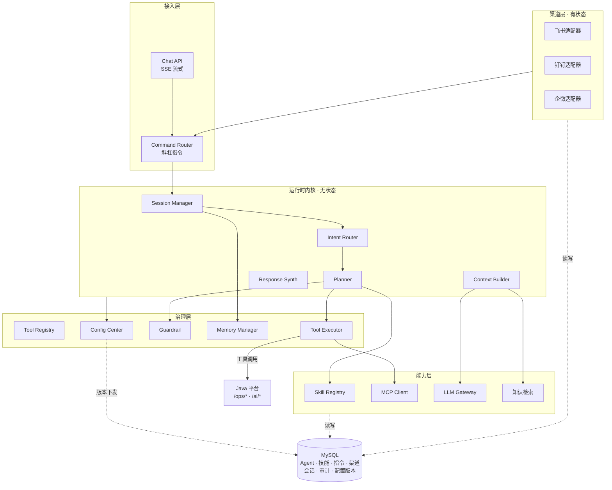
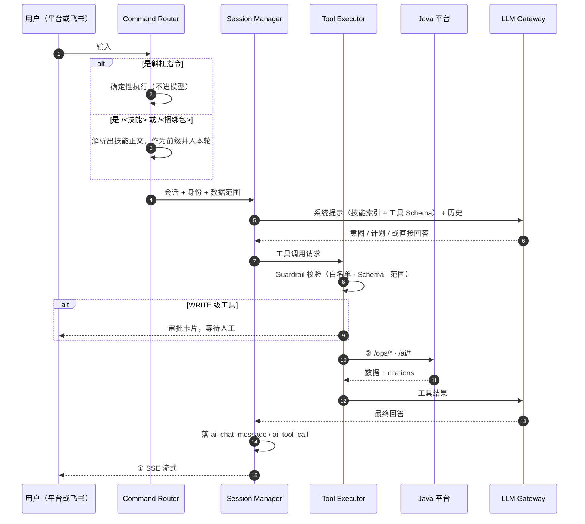

# 智能体平台设计（自研运行时）

> **定位**：《HERMES 智能运维平台完整解决方案》（下称"原方案"）讲 Java 平台自身，[`interface-contract.md`](interface-contract.md) 讲两边怎么对接，本文讲**智能体部分自己实现**的架构。
> 状态：草案 · 2026-09-29

---

## 0. 定位与前提

**「HERMES Runtime」= 我们自己写的智能体运行时**，沿用原方案 §11 的称呼。它与开源项目 `NousResearch/hermes-agent` **不是同一个东西**——后者只作参考实现（§1），**不引入依赖、不进部署拓扑**。

**本方案基于原方案编写**：章节编号、表名、接口命名、权限标识全部对齐。原方案已经定下的东西本文不改，只补它没写的「智能体内部怎么实现」。

**两条纪律**（贯穿全文）：

1. **模型永远看不到 `/ops/*` 的凭据**——工具由 Tool Executor 发起，身份与数据范围在服务端注入并复核。
2. **模型不直连任何生产系统**，只能经 Tool Executor。

**跨边界接口以 [`interface-contract.md`](interface-contract.md) 为准**，本文不复制。

---

## 1. 参考 Hermes，抄什么不抄什么

既然重写，就没必要重新发明。以下是从 `NousResearch/hermes-agent` 源码里**值得照搬的设计**（公开实现，可直接借鉴）：

**抄：**

| 设计 | 为什么值得抄 |
|---|---|
| **SKILL.md 格式**（YAML frontmatter + Markdown 正文） | 人可读、可 diff、可版本化；编辑器和 Git 都能直接管 |
| **技能渐进披露** | 系统提示里只放「名字 + 一句话」索引，模型选中才加载全文——直接决定上下文成本 |
| **斜杠指令三类来源**（内置 / 技能自动成指令 / 捆绑包） | 装一个 skill 就自动有一条指令，不用写任何指令代码 |
| **工具注册表 + 安全等级 + 参数 Schema** | 权限在工具层强制，不靠提示词约束模型 |
| **审批四选项**（允许一次 / 本次会话 / 始终 / 拒绝） | 分级授权，粒度已经被验证过是对的 |
| **渠道适配器的 @ 门控与配对** | 群里不能被任意人触发；陌生人的第一条消息要走配对 |
| **上下文压缩**（超阈值时摘要历史、保留最近 N 轮原文） | 长会话必然遇到，早设计比晚补便宜 |

**不抄：**

| 设计 | 为什么不抄 |
|---|---|
| **插件 ABI**（Python 进程内钩子） | 那是"不改源码还要插手"的做法。**我们没有宿主，钩子自动消失**——工具调用、审批、参数注入全在自己进程里 |
| **PTY / TUI 那一套** | 面向终端，与气泡界面无关 |
| **多 provider 全家桶**（MoA、auxiliary、reasoning 分层等） | 我们只需要一个能干活的模型入口，见 §11 |

> **一句话**：起点不是"从零"，是"已经有一个被验证过的设计可以参考，且不用背它的包袱"。

---

## 2. 总体架构

### 2.1 模块划分

保留原方案 §11.1 的 11 个模块，新增 5 个（★ 标记）。**同名模块职责与原方案一致**：

| 模块 | 职责 | 来源 |
|---|---|---|
| ★ Config Center | 配置版本、下发、失效广播——**热更新的载体**（§10） | 新增 |
| ★ Command Router | 斜杠指令解析与分发（确定性，先于 LLM） | 新增 |
| Chat API | 会话接口和 SSE 流式输出 | §11.1 |
| Session Manager | 会话、消息和上下文摘要 | §11.1 |
| Intent Router | 识别日志、告警、Nacos、知识和问数意图 | §11.1 |
| Planner | 生成受控工具执行计划 | §11.1 |
| Tool Registry | 工具定义、版本、权限和参数 Schema | §11.1 |
| Tool Executor | 超时、重试、熔断和审计 | §11.1 |
| Context Builder | 合并多工具返回的数据 | §11.1 |
| LLM Gateway | 适配不同大模型服务 | §11.1 |
| Memory Manager | 短期会话记忆和受控长期记忆 | §11.1 |
| Guardrail | 权限、敏感信息和提示词注入防护 | §11.1 |
| Response Synthesizer | 组织答案、证据和建议 | §11.1 |
| ★ Skill Registry | 技能加载、索引、渐进披露 | 新增 |
| ★ MCP Client | 外部 MCP 服务器接入（扩展位） | 新增 |
| ★ Channel Adapter | 飞书/钉钉/企微双向对话接入（§9） | 新增 |

### 2.2 分层视图



**两条纪律**见 §0。

### 2.3 部署单元

对齐原方案 §4.2，**新增 `channel-gateway`**：

| 单元 | 职责 | 扩容方式 | 状态 |
|---|---|---|---|
| `channel-gateway` ★ | 渠道长连接（飞书/钉钉/企微） | **不能无状态扩容**——按渠道分片，多实例需分片键 | **有状态** |
| `hermes-runtime` | 对话编排、工具执行、RAG、大模型访问 | 无状态扩容 | 无状态 |

> **为什么 `channel-gateway` 必须有状态**：飞书 WebSocket 长连接是**独占**的，同一个 app 起两个连接会互相踢。原方案 §4.2 没有这个单元，因为原文的渠道只做**单向通知**（§8 通知中心，无长连接）。**双向对话是本方案新增的能力，因此新增一个部署单元**。
>
> **初期部署形态**：遵循原方案 §3 原则 9「初期保持有限部署单元」，代码上是独立模块，**部署上先与 `aiagent-backend` 同进程**，压测后再拆。渠道连接数上不去之前，拆开只会增加运维面。

---

## 3. 一次问答的执行链

对齐原方案 §5.4，展开到模块级：



**与原方案 §5.4 的差异**：原文是「身份和数据范围校验 → 意图识别 → …」。自研版在**意图识别之前**插入 Command Router——因为斜杠指令是**确定性**的，不该花钱让模型判断。这一点直接决定 §7 的设计。

---

## 4. 技术栈与运行时

沿用原方案 §21.1 基线：**Java 21 + Spring Boot 3.5 + MyBatis-Plus + MySQL**。

| 关注点 | 选型 | 说明 |
|---|---|---|
| HTTP 流式 | Spring MVC `SseEmitter` | 与后端同一套，不引 WebFlux |
| 模型调用 | OpenAI 兼容 HTTP + SSE | 见 §11 |
| 配置广播 | Redis Pub/Sub（已有则复用）或 MySQL 版本轮询 | 见 §10.3 |
| 定时与补偿 | 原方案 §18.4 的 ShedLock + MySQL | 不自建 |
| 表格与图表 | 由 Java 前端渲染，**运行时只返回结构化数据** | 与原方案 §12.1 一致 |

> **不引入 Agent 框架**（Spring AI / LangChain4j）：它们的抽象会盖住「工具安全等级、审批门、数据范围注入」这三件我们最需要说清楚的事。运行时核心（§2.1 那 16 个模块）按模块自己写，边界反而更清楚。MCP Client 是唯一例外——协议实现可以直接用库（§5.5）。

---

## 5. 工具系统

### 5.1 工具注册表

对齐原方案 §11.3 + §11.5。每个工具在 `Tool Registry` 里登记：

```text
toolCode        唯一编码（log.search）
displayName     展示名
safetyLevel     READ / CONTROLLED / WRITE / FORBIDDEN（§11.5）
paramSchema     JSON Schema，入参校验
scopeFields     需要注入的数据范围字段（environment / projectCode / serviceName …）
timeoutMs       默认 10000
retryPolicy     重试次数与退避
enabled         开关
```

**工具集的四个来源**，优先级从高到低：

| 来源 | 何时用 | 归属 |
|---|---|---|
| **内置工具**（14 个） | 运维数据面，§11.3 那张清单 | 随运行时发布 |
| **MCP 工具** | 客户已有的 MCP server、社区能力 | 库里配（§5.5） |
| **技能私有工具** | 某个 skill 自带的脚本 | 技能包内（§6.4） |
| **FORBIDDEN** | 修改生产配置、任意 SQL | **根本不出现在工具表里**（§11.5） |

### 5.2 工具协议

**完全沿用原方案 §11.4 的信封，不改**：

请求：
```json
{ "traceId": "...", "userId": 1001, "tenantId": "default",
  "environment": "prod", "timeoutMs": 10000, "dryRun": true, "arguments": {} }
```

返回：
```json
{ "success": true, "data": {}, "citations": [],
  "errorCode": null, "errorMessage": null, "durationMs": 200 }
```

补充三条原文没写、但自研必须定的：

1. **`citations` 是硬要求**。查询类工具返回空数组 = 失败。§11.5 要求「回答必须区分已确认事实、基于证据的推断、缺失数据」——没有 citations 就做不到。
2. **`dryRun` 对 WRITE 级工具强制先跑一次**（校验参数、返回将要做什么），再进审批门。
3. **`traceId` 由 Chat API 生成，全链路透传**（对齐 §19.2「前端、后端、HERMES、工具调用…必须传递统一 traceId」）。

### 5.3 内置工具清单

**原样保留原方案 §11.3 的 14 个工具**，一个不改：

```text
log.search  log.context  log.aggregate
alert.query  alert.acknowledge  alert.resolve  alert.suppress
nacos.change.query  nacos.config.query  nacos.instance.query
knowledge.search  database.metric.query  report.generate  notification.send
```

安全等级与 §11.5 一致：`alert.acknowledge / resolve / suppress`、`report.generate`、`notification.send` 是 **WRITE / CONTROLLED**，必须过审批门。

**逐工具入参与出参模型以 [`interface-contract.md`](interface-contract.md) §4.3-4.4 为准。**

> **仍然悬空的 2 个**：`database.metric.query` 与 `notification.send` **在 Java 侧还没有对应端点**（见契约 §9 第 3 条）。工具可以先注册、调用时返回明确错误，但**不能假装可用**。

### 5.4 MCP 工具如何并进同一张表

MCP 工具进注册表时**做一次归一化**，让上层完全无感：

| 归一化项 | 规则 |
|---|---|
| `toolCode` | `mcp.<server>.<tool>`（与内置工具的 `域.动作` 区分开） |
| `paramSchema` | 用 MCP 的 `inputSchema`；补齐 `additionalProperties` 语义 |
| `safetyLevel` | **默认 READ**；要提级必须在库里显式配，且要过审批门 |
| `scopeFields` | MCP 工具**不注入**数据范围（它不是我们的数据面） |
| `citations` | MCP 返回文本时 `citations` 为 `[{kind:"mcp", source:<server>, title:<tool>}]` |

> **安全底线**：MCP 是**外部**能力，工具的作者不是我们。所以它**默认只读**，且**不携带用户身份**——要带身份必须显式配置，并在 Guardrail 里留痕。

### 5.5 什么时候该用 MCP

MCP 在本方案是**扩展位，不是主路径**。三种情况值得开：

1. 客户已经有 MCP server（内部平台、第三方 SaaS），接进来比写适配器便宜；
2. 需要社区现成能力（搜索、网页抓取、某些专用 API）；
3. 某个工具需要**独立进程/独立语言**实现（隔离风险或复用已有服务）。

**内部 14 个工具不要走 MCP**——多一层协议、多一次序列化、身份注入还要额外设计。它们是我们的数据面，走 §5.2 的原生协议。

---

## 6. 技能（Skill）系统

### 6.1 技能是什么

**技能 = 一份 Markdown 文件 + 一段 YAML 头**。它是**提示词资产**，不是代码。借鉴 Hermes 的 `SKILL.md` 约定：

```markdown
---
name: code-review
description: "审查代码变更：安全扫描、质量门禁、输出结构化结论。"   # ≤ 60 字，进索引
version: 1.0.0
tags: [代码评审, 质量]
requires_tools: [log.search]        # 声明依赖的工具；缺工具则技能不可用
---

# 代码评审

## 何时使用
- 用户要求评审一段变更 / 一个 PR / 一次发布
- 告警复盘需要看当时的代码差异

## 怎么做
1. …（步骤）
2. …（步骤）

## 注意
- …（边界与红线）
```

`description` 有长度约束：它会进**每一次请求的系统提示**，一个字都不能浪费。

### 6.2 渐进披露（省 token 的关键）

| 阶段 | 进上下文的东西 | 成本 |
|---|---|---|
| **索引**（每轮都在） | 全部技能的 `name` + `description`，每个一行 | O(技能数)，可控 |
| **加载**（模型选中才发生） | 该技能的 SKILL.md 全文 + 声明的 `requires_tools` | O(单技能) |

模型通过**内置的 `skill.load`** 工具按名字取正文。系统提示里**不放正文**——这是几百个技能也没把上下文撑爆的原因。

> **技能数量上限**：索引每行约 15 token。按 8K token 预算给技能索引算，**上限约 500 个技能**。超了要分组或改两级索引，这是 §17 待确认项。

### 6.3 技能的三个来源

| 来源 | 形态 | 热更新 |
|---|---|---|
| **内置技能** | 随运行时发布，运维场景预置（故障排查、告警复盘、变更核对…） | 随版本 |
| **平台上传** | 前端 Markdown 编辑器，存库、版本化 | **免重启**（§10） |
| **Agent 生成** | 由模型从一次成功处置中提炼 SKILL.md | **二期** |

一期做前两个。第三个价值很大（运维知识会自然沉淀），但需要审校流程（谁批准 AI 写的技能），放二期。

### 6.4 存储：库为权威

```text
ai_skill          技能元数据（code · name · description · status · current_version）
ai_skill_version  不可变版本快照（version · content · requires_tools · author · create_time）
```

运行时把启用中的技能加载进 `Skill Registry` 的内存索引，按 §10 的版本号机制失效重建。**不落盘成文件**——文件只作为「导出/人工排查」能力提供，不是运行路径。

---

## 7. 指令（Slash Command）系统

### 7.1 三类来源

| 类型 | 例子 | 解析时机 | 是否进模型 |
|---|---|---|---|
| **内置指令** | `/new` `/stop` `/help` `/model` `/agents` | Command Router 直接执行 | **不进** |
| **技能指令** | 装了 `code-review` 技能 → 自动有 `/code-review` | 把技能正文并进本轮 | 进（带技能上下文） |
| **捆绑包指令** | `/故障复盘` 一次预载 3 个技能 | 同上，只是预载多个 | 进 |

**第二类不需要任何开发**：技能注册时自动向 Command Router 注册一条同名指令。这是这套设计最省事的地方——**新增一个能力 = 加一个 Markdown 文件**。

### 7.2 解析顺序（必须确定）

```text
用户输入
  → 以 "/" 开头？
      否 → 正常对话
      是 → 查内置指令表
             命中 → 直接执行，返回结果（本轮结束，不进模型）
             未命中 → 查技能/捆绑包
                        命中 → 读出技能正文，拼到本轮用户消息前，走正常对话
                        未命中 → 提示"未知指令"，并给近似建议（模糊匹配）
```

**踩坑点**：内置指令**必须先查**。否则用户建了一个叫 `help` 的技能，就会把 `/help` 顶掉——而且顶掉之后没法自己恢复。内置指令**不可被覆盖**，冲突时拒绝保存并提示改名。

### 7.3 一期内置指令表

只做这些，够用且不膨胀：

```text
/new  /stop  /help  /agents  /model  /skills  /commands  /context
```

`/context` 值得做——它把「系统提示、技能索引、工具 Schema、历史各占多少 token」摊开给用户看。上下文成本是这类系统最容易失控的地方，看得见才管得住。

### 7.4 捆绑包

```text
ai_command_bundle   code · name · description · skill_codes[] · status · version
```

一个捆绑包 = 一条指令 + 一串技能。`/故障复盘` = `[告警复盘, 日志排查, 变更核对]` 一次加载。价值在于**把"哪几个技能配一起用"这个知识固化下来**，不用每次让模型自己挑。

---

## 8. Agent 配置与创建

### 8.1 AgentProfile

**完全对齐原方案 §11.2 的字段定义**：

```text
AgentProfile
├── code、name、description
├── systemPrompt
├── modelProvider、modelName
├── temperature、maxTokens
├── enabledTools、toolPolicy
├── timeout、memoryPolicy
├── knowledgeBaseIds
├── status
└── version
```

补充本方案需要、原文未列的字段：

```text
├── enabledSkills          启用的技能（不配=全部可用）
├── enabledCommands        启用的指令
├── enabledMcpServers      挂载的 MCP 服务器
├── channelBindings        绑定的渠道（哪个飞书机器人用这个 Agent）
└── dataScopePolicy        数据范围的默认与上限
```

**`AGENTS.MD` / `SOUL.MD`**（原方案 §11.2 提到）在自研下的落法：
- **`SOUL.MD` → `systemPrompt` 字段**：角色和行为边界，直接就是系统提示的主体。
- **`AGENTS.MD` → 项目/环境的常驻说明**：能力、步骤、工具用法。它是**跨 Agent 共享**的，所以单独一张表（`ai_agent_context_file`），不进 AgentProfile。

> 原文把两者并列，但在实现里它们的**作用域不同**：SOUL 是 Agent 私有的，AGENTS 是环境级的。分开存才不会出现「改了一次 AGENTS，所有 Agent 都变了但没人知道」。

### 8.2 版本化

对齐原方案 §11.2「支持草稿、发布、灰度、回滚和历史版本绑定」：

| 表 | 内容 |
|---|---|
| `ai_agent_profile` | 元数据 + 指向当前发布版本的指针 |
| `ai_agent_version` | **不可变**快照（发布时写死，永不修改） |

状态机：

```text
DRAFT ──发布──▶ PUBLISHED ──下线──▶ DEPRECATED
  ▲                  │
  └────── 回滚 ◀──────┘（把指针指回旧版本，不改旧版本内容）
```

**灰度**：`ai_chat_session.agent_version` 记录会话绑定的版本。新会话默认用 `PUBLISHED`，需要灰度时按比例把新会话指到目标版本；**会话中途不切版本**（切了历史上下文就对不上 Agent 的人设了）。

### 8.3 创建 Agent 的流程

前端一张表单，后端一个事务：

```text
① 选模板        空白 / 从已有 Agent 复制 / 预置模板（日志排障·告警处置·报表解读）
② 基本信息      code(唯一) · name · description
③ 人设          systemPrompt（SOUL 正文），带变量占位符 {environment} {serviceName}
④ 模型          选 provider + model（§11）
⑤ 工具          从 Tool Registry 勾 enabledTools，WRITE 级的要显式确认
⑥ 技能          勾 enabledSkills（可选，不勾=全部可用）
⑦ 知识库        勾 knowledgeBaseIds
⑧ 渠道绑定      选哪个飞书机器人接这个 Agent（可留空）
⑨ 数据范围      默认范围 + 上限（不能超过创建者的权限）
⑩ 保存草稿 → 试跑 → 发布
```

**「试跑」不能省**：发布前必须能在侧栏里用当前草稿配置跑一轮真实问答。运维 Agent 的人设写歪了，线上是看不出来的——它只会安静地给出错的建议。

### 8.4 运行时隔离

**不用目录级 profile 隔离**。自研走**逻辑隔离**：

| 隔离项 | 机制 |
|---|---|
| 配置 | 按 `agentCode` 从库里取，运行时内存缓存 |
| 工具 | Tool Registry 按 `enabledTools` 过滤——**在 Executor 层强制**，不是提示词约束 |
| 技能 | Skill Registry 按 `enabledSkills` 过滤，索引只暴露允许的 |
| 记忆 | `ai_chat_session` 按 agent 分作用域 |
| 审计 | `ai_tool_call` 记 agent_code |

> **为什么够用**：目录隔离解决的是「同一个进程里跑互不信任的多个用户」。我们的 Agent 都是**同一个组织、同一套权限体系**下的不同角色，逻辑隔离 + 服务端强制就够。多一层目录只会多一份运维面。

---

## 9. 渠道对接（飞书/钉钉/企微）

### 9.1 定位

原方案 §8 的**通知中心是单向的**（平台 → 群，发告警）。本节讲的是**双向对话**：人在飞书里 @ 机器人提问，机器人调工具答。这两件事**共用渠道凭据，但走完全不同的代码路径**：

| | 通知中心（原方案 §8） | 渠道适配器（本节） |
|---|---|---|
| 方向 | 单向推送 | 双向对话 |
| 连接 | 无长连接，HTTP 发完即走 | **独占长连接**，必须常驻 |
| 部署 | 无状态，跟 `aiagent-backend` | **有状态**，独立单元（§2.3） |
| 身份 | 无（系统消息） | **需要把渠道用户映射到平台用户** |

> **必须先说清楚的一件事**：这两条路径如果实现成同一个模块，通知量一大就会把对话连接拖死。**分子包，共享凭据，不共享连接**。

### 9.2 要实现的清单（飞书为例）

| 能力 | 一期 | 说明 |
|---|---|---|
| WebSocket 长连接 + 自动重连 | ✅ | 出站长连，不需要公网入口 |
| 消息接收与解析 | ✅ | 文本、@ 识别 |
| **@ 门控** | ✅ | 群里只有被 @ 才响应 |
| **用户配对** | ✅ | 陌生人的第一条消息走配对确认，不直接进 Agent |
| 卡片消息（流式更新） | ✅ | 边生成边刷新，体验的关键 |
| Agent 选择 | ✅ | 多 Agent 时按指令或关键词路由 |
| 图片 / 文件 | 二期 | |
| 话题 / 消息锚定 | 二期 | |
| 会议邀请、云文档评论 | 二期 | 运维场景用不上 |

### 9.3 身份映射（最容易漏的一块）

```text
飞书 open_id / union_id ──▶ ai_channel_user ──▶ 平台 userId（原方案 §17.1 权限体系）
```

**三条规矩**：

1. **未绑定的用户不进 Agent**——先配对，配对是为了把渠道身份挂到平台账号上。
2. **数据范围按平台账号算**，不按渠道算。飞书里能问到的数据，和他在平台里能看到的**完全一致**。
3. **渠道来的每一轮都记 `ai_tool_call`**，`channel` 字段标明来源。审计不能因为"从飞书来的"就断链。

**配对方式待定**（契约 §9 第 12 条）：自助配对 / 管理员预绑定 / 企业通讯录同步。

### 9.4 工作量（诚实版）

| 项 | 参考量级 |
|---|---|
| 飞书适配器（一期范围） | **1.5 ~ 2 人月** |
| 钉钉 / 企微（各一期范围） | 各 0.8 ~ 1 人月 |
| 渠道管理后台（前端） | 0.5 人月 |

**参考对照**：开源 Hermes 的飞书适配器是 **4,447 行**——那是覆盖了图片、视频、语音、文档、话题、会议邀请、云文档评论的全量实现。一期砍到上面那个清单，量级能小一大截，但**不要低估长连接的稳定性成本**（重连退避、心跳、消息去重、乱序、重复投递）。这部分不在功能清单里，但会在联调期吃掉大部分时间。

---

## 10. 热更新

**这一章是自研最直接的收益**：配置、模型、渠道**都不需要重启**。

### 10.1 六类配置 × 一条生效路径

配置**全部存 MySQL**，运行时**无状态**，所以「生效」= 让各实例的缓存失效。

| 配置 | 存哪 | 生效路径 |
|---|---|---|
| **模型/供应商** | `ai_model_provider` | 下一个 turn（含密钥引用） |
| **MCP 服务器** | `ai_mcp_server` | 下一个 turn（新工具注册进 Tool Registry） |
| **技能** | `ai_skill` + `ai_skill_version` | 下一个 turn / `/skills` 立即 |
| **指令与捆绑包** | `ai_command_bundle` | 下一个 turn |
| **Agent 配置** | `ai_agent_profile` + `ai_agent_version` | 下一个 turn；会话 pin 版本时不跟随 |
| **渠道凭据** | `ai_channel` | **立即**——热停/起适配器连接（§10.4） |

**六个里五个走「下一个 turn」就够了**，因为对话本来就是轮次的。**不需要**为了"立刻生效"去做复杂的东西——用户改完配置，下一句话生效，这个体验已经足够好。

### 10.2 配置版本号

```text
ai_config_version    scope(agent|skill|mcp|model|command|channel) · version · update_time
```

规则：

- 任何配置写操作 = **一个事务**：写业务表 + `version + 1`。
- 每个实例内存里存 `Map<scope, version>`，与本地缓存的配置内容绑定。
- **每个 turn 开始时比对一次版本号**（一次轻查询，或走 §10.3 的广播）。不一致就重载该 scope。

> **为什么用「每个 turn 比对」而不是「纯广播」**：广播会丢（网络分区、实例重启、漏订阅）。版本号对账是**幂等的兜底**，广播只是把生效时间从"下一轮"压到"立即"。**两者都要有，但兜底的那个必须是版本号**。

### 10.3 广播（可选加速）

有 Redis 就发 `config.changed{scope, version}`，实例收到后立刻失效缓存。没有 Redis 就退化成纯版本号对账（最多晚一个 turn）。**不引入新组件**——这条不该成为加 Redis 的理由。

### 10.4 渠道适配器的热注册（重点）

渠道是**唯一不能等下一个 turn 的**——连接断了就是断了，用户消息根本进不来。

```text
ai_channel 变更
  → 发 channel.changed{channelId, version}
  → channel-gateway 收到：
       新增 → 起连接
       凭据改 → 停旧连接 → 起新连接
       停用 → 停连接
  → 停旧连接时：宽限窗口内不接新会话，进行中的轮次跑完再关（默认 30s，可配）
```

**三个必须处理的边界**：

1. **改凭据时不能断流**——先起新连接、确认握手成功，再停旧的。直接停旧的会出现「改了密钥，机器人失联」。
2. **连接状态要回报**——`ai_channel.status` 记 `connected / connecting / failed + error_message`，前端要能看到。**运维系统里，"配置保存了但实际没连上"是最坑的状态**。
3. **多实例分片**——同一个渠道同时只能有一个实例持有连接。用 `ai_channel.owner_instance` + 心跳抢占来保证。

---

## 11. 模型接入（LLM Gateway）

### 11.1 抽象

按 **OpenAI 兼容协议**做唯一抽象层：`/chat/completions` + SSE 流式 + `tools` 参数。所有 provider 通过配置适配到这一个形状。

```text
ai_model_provider    code · name · base_url · api_key_ref · enabled
ai_model             provider_code · model_name · context_window · supports_tools · enabled
```

> **具体接哪个模型未定**：原方案 §26 待确认第 9 条「大模型使用企业平台、云模型还是本地模型」还没拍板。本文只定抽象层，不锁 provider。

### 11.2 三个必须处理的现实问题

1. **不是所有模型都支持 function calling**。`supports_tools` 字段就是干这个的——不支持工具调用的模型不能跑 Agent，只能做纯问答。**在配置页面就要拦住，不能等运行时才发现**。
2. **各家工具调用的 JSON 格式有差异**（参数是字符串还是对象、并行调用怎么表达）。适配层要**归一化**，否则每换一个模型就得改一遍 Planner。
3. **流式响应里的工具调用是分片的**（`tool_calls[].function.arguments` 按 delta 拼接）。这是最经典的一个坑，必须一次性做对。

### 11.3 密钥

对齐原方案 §17.2：**禁止明文保存**，优先接密钥管理服务，否则用应用主密钥加密，主密钥只放运行环境。`api_key_ref` 存的是引用，不是值。

---

## 12. 安全与审计

安全要求**沿用原方案 §17，不重复**。本节只列自研实现里**必须落在代码上**的部分：

| 要求 | 出处 | 落在哪 |
|---|---|---|
| 工具参数必须通过 Schema 校验 | §17.4 | Tool Executor，**校验失败直接拒绝**，不重试 |
| 权限不能由大模型自行决定 | §17.4 | 数据范围由服务端注入，模型不可见不可改 |
| 有副作用的工具必须确认并审计 | §17.4 | 审批门（§12.1） |
| 日志、文档、配置视为不可信数据 | §17.4 | Context Builder 做内容隔离标记 |
| 在发送大模型前脱敏 | §17.3 | LLM Gateway 出口统一脱敏 |
| 所有动作可审计 | §17.1 | `ai_tool_call` 表 |

### 12.1 审批门

WRITE / CONTROLLED 级工具触发。四选项**沿用已被验证的粒度**：

| 选项 | 作用域 | 持久化 |
|---|---|---|
| **允许本次** | 本次调用 | 否 |
| **允许本会话** | 当前会话内所有匹配调用 | 否，会话结束清除 |
| **始终允许** | 该工具的后续所有调用 | **是**，写白名单表 |
| **拒绝** | 本次调用 | 否 |

**默认必须 fail-closed**：审批超时、审批通道异常、无人应答 → **一律按拒绝处理**。这条不能有例外。

**「始终允许」要有边界**：只能对**幂等**的写操作开放（如"确认告警"），且必须记录是谁在什么时候开的。`alert.suppress`（静默告警）这类会掩盖问题的操作，**建议不开放"始终允许"**。

### 12.2 审计

```text
ai_tool_call    trace_id · session_id · agent_code · tool_code · safety_level
                arguments(脱敏) · success · error_code · duration_ms
                approval(谁批的/什么方式) · channel · create_time
```

**审计是只写的**——没有任何接口能改或删。这是原方案 §17 的前提，也是这套系统能被审计人员接受的前提。

---

## 13. 数据表

对齐原方案 §14.2，**沿用其表名约定**，`ai_` 前缀。原文已有的表**不改**：

```text
# 原方案 §14.2 已定义，本文直接使用
ai_agent_profile        ai_agent_version
ai_knowledge_base       ai_knowledge_document       ai_knowledge_document_version
ai_knowledge_ingest_task  ai_knowledge_permission
ai_chat_session         ai_chat_message            ai_tool_call
```

本方案新增（原文未列）：

```text
ai_skill                技能元数据
ai_skill_version        技能版本快照
ai_command_bundle       指令捆绑包
ai_mcp_server           MCP 服务器配置
ai_mcp_tool             MCP 工具归一化后的注册项
ai_channel              渠道配置与连接状态
ai_channel_user         渠道用户 ↔ 平台用户映射
ai_model_provider       模型供应商
ai_model                模型条目
ai_agent_context_file   环境级常驻说明（AGENTS.MD）
ai_config_version       配置版本号（§10.2）
```

所有业务表继续携带 `del_flag / create_by / create_time / update_by / update_time`（原方案 §14.2 约定）。

**关键索引**：

```text
ai_agent_profile(agent_code) UNIQUE
ai_agent_version(agent_code, version) UNIQUE
ai_skill(skill_code) UNIQUE
ai_channel(channel_code) UNIQUE
ai_config_version(scope) UNIQUE
ai_channel_user(channel_code, channel_user_id) UNIQUE
ai_chat_message(session_id, create_time)
ai_tool_call(trace_id, create_time)
```

---

## 14. 接口面

### 14.1 跨边界接口

**以 [`interface-contract.md`](interface-contract.md) 为准**，本文不重复：

| 方向 | 契约章节 |
|---|---|
| Java 平台 → 智能体平台（`/api/*`） | 契约 §3 |
| 智能体平台 → Java 平台（`/ops/*` `/ai/*`） | 契约 §4 |
| 渠道 ↔ 智能体平台 | 契约 §5 |

### 14.2 权限标识

沿用原方案 §17.1 已定义的：`ai:agent:manage` / `ai:knowledge:query` / `ai:knowledge:manage` / `ai:chat:use` / `ai:database:query` / `ai:tool:execute`。

本方案新增两个：

```text
ai:skill:manage      技能增删改
ai:channel:manage    渠道配置
```

---

## 15. 分期与工作量

| 期 | 交付 | 依赖 | 估工 |
|---|---|---|---|
| **一** | 运行时骨架：Chat API + SSE、Session、Tool Registry/Executor、内置指令、Config Center、审计 | 无 | 3~4 人月 |
| **二** | 14 个内置工具接真实 `/ops/*` `/ai/*`、审批门、数据范围注入 | **等 Java 接口就绪** | 2 人月 |
| **三** | Agent 配置与版本化、Skill Registry、指令捆绑包、模型接入 | 一期 | 2 人月 |
| **四** | 渠道对接（飞书一期范围）、身份映射、渠道管理后台 | 三期 | 2 人月 |
| **五** | MCP 扩展位、记忆与上下文压缩、生产强化 | 全部 | 2~3 人月 |

**合计 11~13 人月**到"完整可用"。

**一期不依赖 Java 侧，可以立刻开工**——这也是把骨架排在第一期的原因：Java 的 `/ops/*` 接口就绪前，我们不会闲着。

---

## 16. 风险

| 风险 | 影响 | 应对 |
|---|---|---|
| **渠道长连接稳定性** | 机器人失联、消息丢失 | 一期限定范围（§9.2）；重连退避 + 心跳 + 消息去重；`ai_channel.status` 可观测；联调期留足缓冲 |
| **模型工具调用能力差异** | 换模型后 Agent 行为突变 | `supports_tools` 前置校验（§11.2）；适配层归一化；换模型前跑回归用例 |
| **上下文成本失控** | 响应变慢、费用上升 | 技能渐进披露（§6.2）；`/context` 可视化（§7.3）；上下文压缩 |
| **技能质量参差** | 模型被错误指引 | 技能发布前校验 `requires_tools`；内置技能人工审校；二期 AI 生成技能必须过审 |
| **交付周期** | 11~13 人月，跨度大 | 严格分期（§15）；一期不依赖 Java 侧可先落地；每期有可验收产物 |
| **工具误报** | 模型基于残缺/未完成数据下结论 | `truncated` / `accepted` 字段（契约 §4.4.1、§4.4.8）；工具描述里显式写明 |
| **审批被绕过** | 越权写操作 | fail-closed（§12.1）；工具执行层强制，不靠提示词 |

---

## 17. 待确认

1. **渠道一期范围**——飞书是否只需要文本+卡片？有没有图片/文件/话题的硬需求？（契约 §9 第 12 条）
2. **模型 provider**——原方案 §26 第 9 条未定；`supports_tools` 决定 Agent 能力上限。
3. **技能上限**——§6.2 推算约 500 个技能撑满 8K 索引预算，实际能到多少要看技能描述的平均长度。
4. **渠道身份配对策略**——自助配对 / 管理员预绑定 / 企业通讯录同步？（契约 §9 第 12 条）
5. **`database.metric.query` / `notification.send`**——Java 侧端点仍缺（契约 §9 第 3 条），工具先占位不可用。
6. **上下文压缩阈值**——按模型 `context_window` 比例还是固定 token 数？原方案 §11.1 只说"会话、消息和上下文摘要"，没给阈值。
7. **「始终允许」的开放范围**——§12.1 建议只对幂等写操作开放，需要业务侧确认哪些算幂等。
8. **一期骨架是否先与 `aiagent-backend` 同进程部署**——§2.3 建议先合并，需确认服务器资源与运维接受度。

---

## 附：参考 Hermes 的出处索引

本文借鉴的设计与其在参考实现中的位置（便于需要时核对细节）：

| 借鉴的设计 | 参考位置 |
|---|---|
| `SKILL.md` 格式与 frontmatter 字段 | `skills/software-development/codebase-inspection/SKILL.md` |
| 技能作为 `/<name>` 指令自动可用 | `website/docs/reference/slash-commands.md:158` |
| 技能捆绑包（`<slug>.yaml` → `/<slug>`） | `website/docs/user-guide/features/skills.md:479` |
| 技能热重扫 | `website/docs/reference/slash-commands.md:120` |
| 审批四选项与作用域表 | `website/docs/user-guide/features/acp.md:295` |
| 审批超时/异常一律按拒绝 | 同上（"超时或出错时，审批桥接会拒绝请求"） |
| 渠道 @ 门控与 DM 配对 | `plugins/platforms/feishu/plugin.yaml` |
| 上下文分类与占用可视化 | `website/docs/reference/slash-commands.md:66` |
| 配置热加载的分层 | `gateway/run_profile_reconcile.py` |
| 飞书适配器全量实现（工作量的对照基准） | `plugins/platforms/feishu/adapter.py`（4,447 行） |
