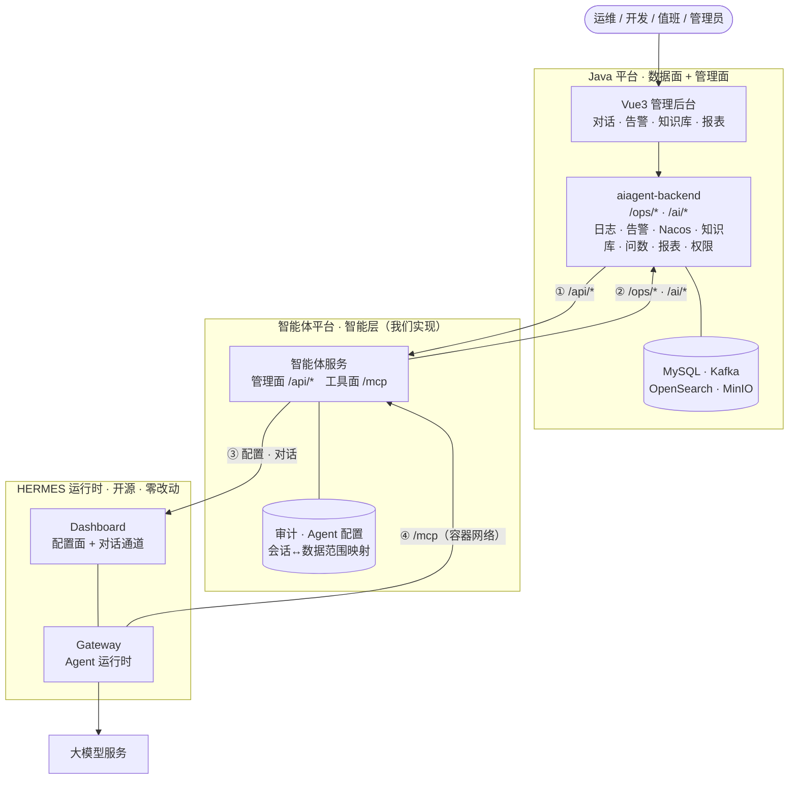
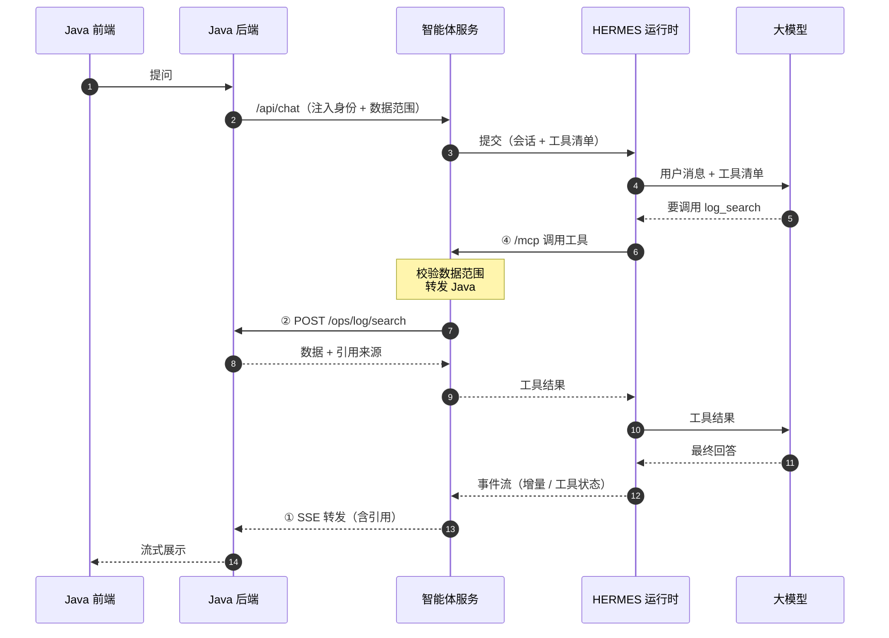
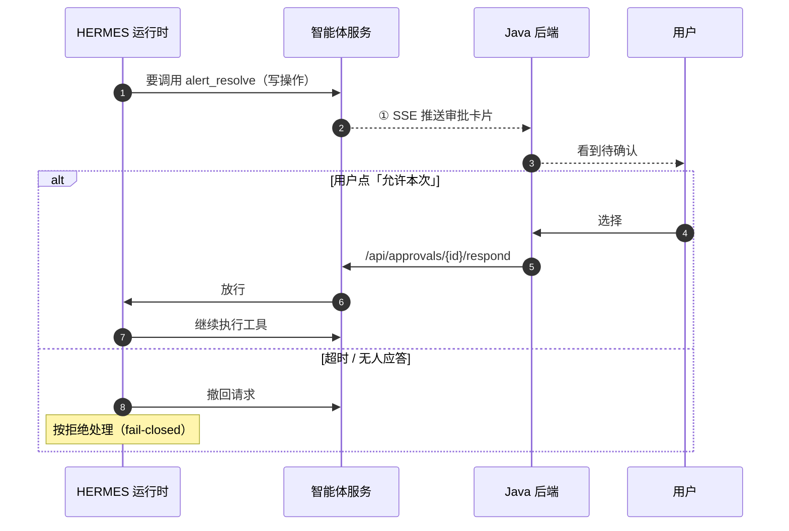

# HERMES 智能运维平台 · 方案概览

> **5 分钟版。** 本文只讲「是什么、怎么连、谁做什么」；细节见本目录其余三份文档（§5 文档地图）。
> 状态：草案 · 2026-09-29

---

## 1. 一句话

**Java 平台管数据和界面，智能体平台管智能，两边用一份接口契约对接，底层跑不改动的开源 Hermes。**

要解决的事：日志、告警、Nacos 变更、运维知识库、智能问数、健康报表——全部通过**受控工具**交给大模型，而不是让模型直接碰生产系统。

---

## 2. 全景架构

**四条跨边界连线**：

| # | 方向 | 说明 |
|---|---|---|
| ① | Java 后端 → 智能体服务 | 管理面 `/api/*`：发消息、审批应答、Agent 配置、会话查询 |
| ② | 智能体服务 → Java 后端 | 工具面回头调数据：`/ops/*`、`/ai/*` |
| ③ | 智能体服务 → HERMES Dashboard | 配置走 REST；对话走 `WS /api/ws`（JSON-RPC） |
| ④ | HERMES → 智能体服务 | MCP 工具调用，走容器网络（**Streamable HTTP**） |

> **前端不是我们的交付物**：用户界面由 Java 的 Vue 应用承载。
> **没画的一条线**：模型 ↔ 生产数据源——**不存在**，只能经 ② 绕一圈。

---

## 3. 一次问答的链路

**关键点**：模型看到的只有工具，看不到平台凭据；`/ops/*` 的调用由智能体服务发起，身份和范围由 Java 侧注入并复核。

---

## 4. 写操作要人工确认

只读工具直接执行；**写操作（确认告警、解决告警、静默、发通知、出报表）必须由人点过才生效**。

选项：**允许一次 / 允许本次会话 / 始终允许 / 拒绝**。超时一律按**拒绝**处理。

---

## 5. 谁做什么

| 方 | 负责 | 不负责 |
|---|---|---|
| **Java 平台** | 数据面（日志 / 告警 / Nacos / 知识库 / 问数 / 报表）+ 管理后台 + 用户权限 | 不做智能体运行时 |
| **智能体平台**（我们） | HERMES 接入、14 个受控工具、审批、审计、Agent 配置、对话编排 | 不碰生产数据源、不做业务页面 |
| **HERMES 运行时** | Agent 运行时（开源，外部依赖） | **一行源码都不改** |

---

## 6. 文档地图

| 文档 | 写什么 | 读者 |
|---|---|---|
| **`00-overview.md`（本文）** | 5 分钟看懂整体方案 | **所有人先读这份** |
| `platform-solution.md` | Java 平台侧：数据面 + 管理后台 + 权限 | Java 团队 |
| `interface-contract.md` | **两边怎么对接**：双向 API、工具映射、网络认证、数据归属 | **双方评审** |
| `agent-platform-design.md` | 智能体平台怎么实现 | 我们 |

**纪律**：同一件事只出现在一份文档里，其他地方引用，不复制。**冲突时以《接口契约》为准。**

---

## 7. 八条关键设计决策

| # | 决策 | 一句话理由 |
|---|---|---|
| 1 | **封装开源 HERMES，不改源码** | 它是外部依赖，能力经 MCP + 配置 + 身份文件驱动，将来可替换 |
| 2 | **前端在 Java 侧** | 我们只提供 API |
| 3 | **工具优先** | 模型只能通过 14 个受控工具访问数据，不直连生产系统 |
| 4 | **权限前置、模型无权决定** | 身份由 Java 注入；数据范围在服务端校验，**工具侧才是权威** |
| 5 | **默认只读** | 写操作必须人工审批；不可逆动作（如关闭告警）**根本不给工具** |
| 6 | **有证据回答** | 查询接口必须返回 `citations`，回答引用来源 |
| 7 | **一个进程、两个面** | 管理面 `/api/*` 与工具面 `/mcp` 同进程但**认证严格分开** |
| 8 | **先合后拆** | 初期保持有限部署单元，负载增长后再拆 |

---

## 8. 分期

| 期 | 内容 | 依赖 |
|---|---|---|
| 一 | MCP 端点骨架、审批闭环、审计落库、traceId 贯通 | **不依赖 Java 侧** |
| 二 | 14 个工具接真实 `/ops/*` `/ai/*`，范围校验落地 | 等 Java 接口就绪 |
| 三 | Agent 配置版本化、知识库混合检索 | |
| 四 | 生产强化：多实例粘性路由、指标、定时报表 | |

Java 侧自身分六阶段（原方案 §22），**问答排在第四阶段**——两边按阶段分批联调。

---

## 9. 前提与当前未决

**前提**：全部方案基于「**封装开源 HERMES**」编写。若改为自行重写运行时，智能体侧文档需重做。

**阻塞项**（详见《接口契约》§8 与《智能体平台方案》§12）：

- `database_metric_query` / `notification_send` 两个工具**在 Java 侧还没有对应接口**
- 报表生成**同步还是异步**（工具默认 10s 超时不够）
- 会话归属：Java 侧**建不建**本地索引表

**不阻塞但越早越好**：服务命名、HERMES 镜像 digest 策略、traceId 格式。
