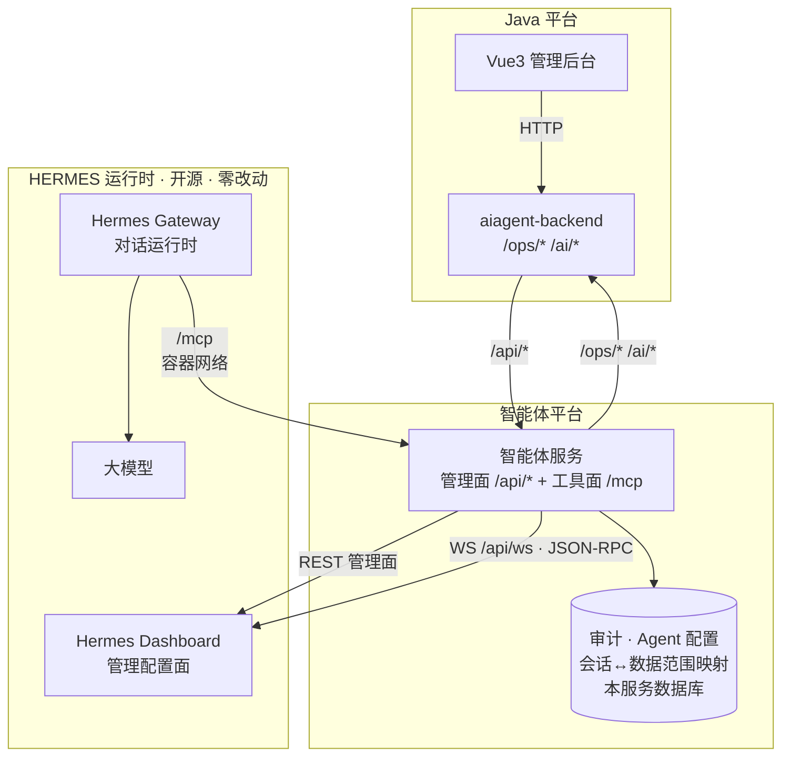
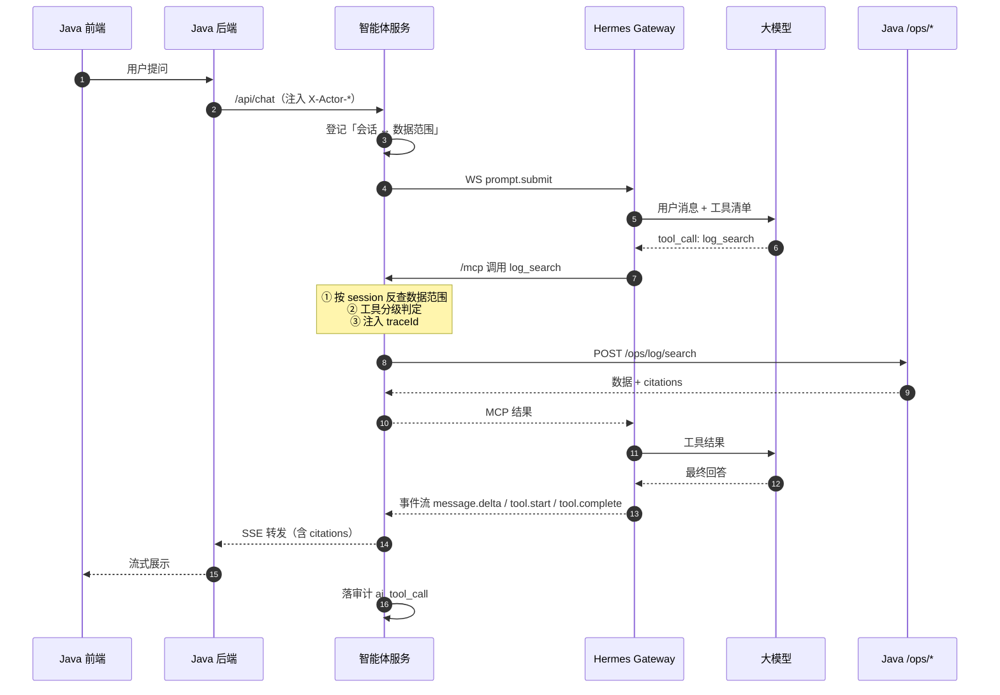
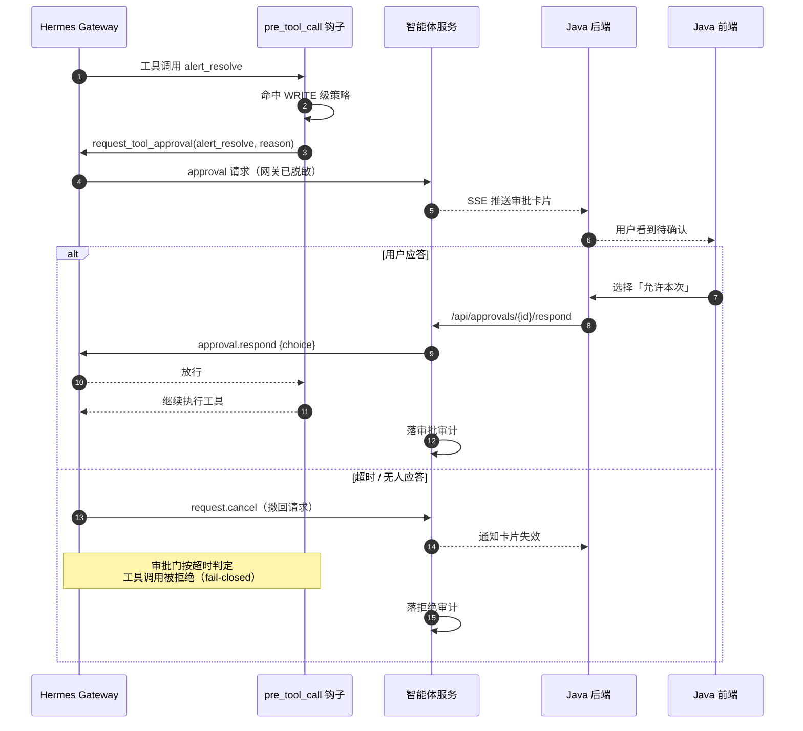
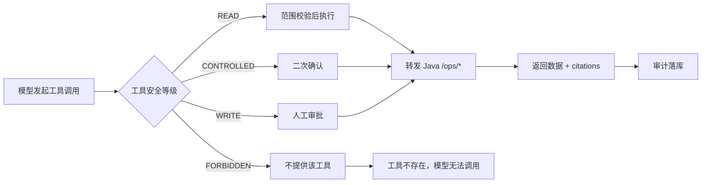
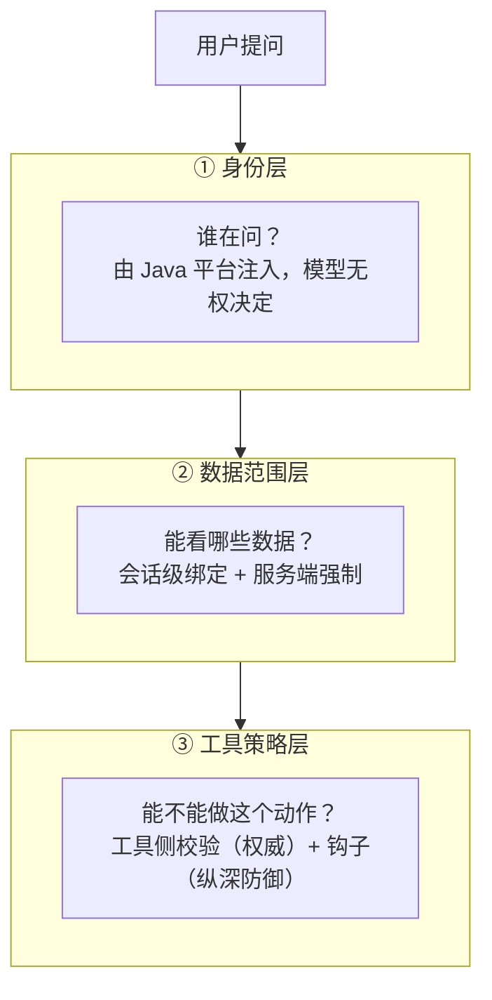

# 智能体平台方案

> 本文是《HERMES 智能运维平台完整解决方案》（下称"原方案"）的配套文档，描述**智能体平台**侧的实现。
> **本文只描述实现，不重复接口定义**——接口面一律见《接口契约》。

| 文档 | 文件 | 写什么 | 读者 |
|---|---|---|---|
| **概览** | `00-overview.md` | 5 分钟看懂整体方案：架构图 + 链路图 | **所有人先读这份** |
| 原方案（Java 侧副本） | `platform-solution.md` | Java 平台：数据面 + 管理后台 + 权限 | Java 团队 |
| 《接口契约》 | `interface-contract.md` | 两边怎么对接：双向 API、网络认证、工具映射 | **双方** |
| **本文** | `agent-platform-design.md` | 智能体平台怎么实现 | 我们 |

**源码核验**（2026-09-29）：本文的技术主张已逐条对照 Hermes Agent 源码验证——MCP HTTP 传输、`approval.respond`、`pre_tool_call` 钩子、审批客户端应答机制、审计事件字段、工具命名规则，均有实证。两处与直觉相反的事实已按源码修正，见 §5.1 与 §6。

---

## 1. 职责边界

| 方 | 职责 | 不做什么 |
|---|---|---|
| **Java 平台** | 数据面与管理面：日志、告警、Nacos、知识库、问数、报表、用户权限 | 不做智能体运行时 |
| **智能体平台**（本文） | 智能层：Hermes 接入、受控工具、审批、审计、Agent 配置下发、对话编排 | 不碰生产数据源、不做业务页面 |
| **Hermes** | Agent 运行时（外部依赖） | **一行源码都不改** |

> **前端不在本文范围**。用户界面由 **Java 平台的 Vue 应用**承载（原方案 `src/views/chat`）。
> 开发期用于验证后端 API 的脚手架界面不属于本方案交付物。

---

## 2. 设计原则

| # | 原则 | 含义 |
|---|---|---|
| 1 | **不改 Hermes 源码** | 它作为外部依赖使用，一切通过 MCP + 配置 + 身份文件驱动 |
| 2 | **工具优先** | 大模型只能通过受控工具访问数据，不直接连接任何生产系统 |
| 3 | **权限前置** | 数据范围由服务端在调用前强制注入与校验，**模型无权决定** |
| 4 | **默认只读** | 生产变更类动作本期禁止或必须人工确认 |
| 5 | **凭据边界** | 平台凭据只存在于智能体服务，**永不进入 Hermes，永不进入对话上下文** |
| 6 | **可替换性** | 我们自己的逻辑全部落在本服务内。进入 Hermes 的**只有一个薄钩子**（§5.2 第 4 个口子），它必须薄到可以随时丢弃重写 |
| 7 | **先合后拆** | 初期保持有限部署单元；负载增长后再拆分 |

---

## 3. 总体架构



**三个要点**：

1. **智能体服务是一个进程、两个面**：管理面 `/api/*` 给 Java 平台调，工具面 `/mcp` 给 Hermes 调。两者**调用者不同、认证不同、协议不同**，逻辑上必须分开设计，物理上同进程（见 §5.1）。
2. **凭据只在这里**：平台令牌只存在于智能体服务，进入 Hermes 的只有工具名和参数。
3. **前端在 Java 侧**：我们不提供用户界面。
4. **只跟 Dashboard 说话**：`WS /api/ws` 是 **Dashboard 的路由**（背后由 `tui_gateway` 处理），不是直连 Gateway 端口——沿用既有链路纪律。

---

## 4. 核心链路

### 4.1 一次问答（含工具调用）



### 4.2 写操作（需人工确认）



> **两个必须处理的协议细节**：
> 1. **超时 fail-closed**：网关撤回请求后，审批门按超时判定，**工具调用被拒绝**，不会悬空等待。
> 2. **撤回 ≠ 拒绝**：`request.cancel` 只撤回"问客户端"这个动作；`choice` 为空时按拒绝处理是协议层自带的兜底。**下游必须处理撤回事件，否则卡片会永远挂着。**

### 4.3 工具调用与权限判定



**工具清单、等级、入参、Java 接口映射 → 见《接口契约》§4.2 / §4.3。**

---

## 5. 组件设计

### 5.1 智能体服务（一个进程，两个面）

| 面 | 端点 | 调用者 | 认证 |
|---|---|---|---|
| **管理面** | `/api/*` | Java 平台 | 平台令牌 |
| **工具面** | `/mcp` | **Hermes** | **bearer token**（独立一套） |

**职责**：

- 对话编排（Hermes Gateway 的 WS JSON-RPC 桥、事件流转 SSE）
- 工具服务（14 个受控工具的 MCP 实现）
- 审批通道（`approval` 请求中转 + `approval.respond` 应答）
- 审计落库
- Agent 配置管理与下发（SOUL / AGENTS / profile / MCP 注册）
- 会话状态与数据范围映射

**为什么两个面同进程**：

- 会话 ↔ 数据范围的映射本来就是它维护的，同进程**免掉一次跨服务查询**
- 凭据只需一处持有
- 平台凭据隔离目标不变——真正的边界是「智能体平台 vs Hermes」，不是内部再切一刀
- 对齐原则 7「先合后拆」

**五条设计约束**（合并带来的，必须遵守）：

| # | 约束 | 原因 |
|---|---|---|
| 1 | **两套认证严格分开** | `/mcp` 不能走管理面鉴权链，反之亦然。混了就是提权漏洞 |
| 2 | **`/mcp` 路由注册顺序正确** | 服务末尾若挂了静态资源，挂载顺序错会吞掉 `/mcp` |
| 3 | **工具调用全程异步** | 工具是 IO 密集，**不得阻塞对话 SSE** |
| 4 | **工具自带超时** | 一个慢查询不能拖住整轮对话 |
| 5 | **MCP 部分做成独立模块** | 留拆分口子——将来真到瓶颈，拔出来就是独立服务 |

### 5.2 Hermes（外部依赖，零改动）

**只通过四个口子使用它**：

1. **MCP** —— 工具注入（Hermes 原生支持，配置 `mcp_servers`）
2. **Dashboard REST** —— 配置管理
3. **Dashboard WebSocket** —— 对话（`WS /api/ws`，JSON-RPC）
4. **`HERMES_HOME` 下的文件** —— 身份文件（SOUL.md 等）+ **插件目录**（`HERMES_HOME/plugins/`，装 §6 的钩子）

**纪律**：不读、不改它的源码。**边界只在这四个口子上**（对齐原则 6）。

> ⚠️ **第 4 个口子是最脆的一环。** 它与其他三个不同：MCP / REST / WS 是**协议面**，而钩子跑在 Hermes 进程内，用的是它的 **Python 插件 ABI**（返回值结构、`session_id` 从哪来），随版本漂移的风险明显更高。
>
> **对冲三条**：① 钩子只做「透传会话句柄」这一件小事，逻辑薄到可以随时重写；② 镜像锁 digest；③ 升级前必须回归钩子——**而契约里的权限模型不依赖它**（§6.2：权威校验在工具侧）。

**运维约束**：

- **镜像锁 digest**，不用 `latest`——它迭代快，锁住才可控
- 升级前先在测试环境验证 MCP、审批行为**与钩子**三样
- 插件通过 `HERMES_HOME/plugins/` 挂载交付，**不改镜像**（已核验：用户插件按 home 发现）

---

## 6. 权限模型

三层，由外到内：



| 层 | 机制 | 要点 |
|---|---|---|
| ① 身份 | Java 平台在转发时注入 `X-Actor-*`（见《接口契约》§3.6） | 模型无法伪造 |
| ② 数据范围 | **会话级绑定**：服务端建会话时登记「会话 ↔ 数据范围」；`pre_tool_call` 钩子按 `session_id` 反查并注入工具参数 | 见下 |
| ③ 工具策略 | **工具侧校验（权威）** + `pre_tool_call` 钩子（纵深防御） | 见下 |

### 6.1 为什么需要钩子来搭这座桥

**MCP over HTTP 的请求里不带会话身份**——headers 是配置里写死的静态值，没有 per-session 信息。

所以「会话 ↔ 数据范围」这条桥只能靠 `pre_tool_call` 钩子来搭：**它的签名里自带 `session_id`**（已核验），可以在调用前把会话身份补进工具参数。

```
Java 注入 X-Actor-*
  → 服务端建会话时登记「会话 ↔ 数据范围」
  → 钩子把 session_id 作为不透明句柄注入工具参数（只透传，不查库）
  → 工具侧按句柄查自己的库 → 拿数据范围 → 独立复核（权威）
```

**三个设计要点**（缺一个这个机制就不成立）：

| # | 要点 | 为什么 |
|---|---|---|
| 1 | 钩子只**透传句柄**，不查库、不判断 | 钩子跑在 Hermes 进程内，**不给它任何凭据**（原则 5）；它越薄，替换成本越低（原则 6） |
| 2 | 注入是**覆盖写**，模型改不动 | 钩子的 `modify` 在模型产出的参数**之后**做合并，同名字段以钩子为准——**这就是「模型无权决定」的落地依据** |
| 3 | 工具侧**查不到句柄 = 拒绝** | 钩子异常时是 fail-open（§6.2），此时参数里可能是模型自己填的值。**权威侧必须拒绝未知句柄**，否则伪造句柄即可越权 |

> **所以注入的必须是「不透明句柄」，而不是「数据范围本身」**：句柄由服务端签发、不可猜。即使钩子失效让模型填了值，工具侧也只会看到一串查不到的随机串，直接拒绝。

**不采用 profile 隔离**：那需要网关切 multiplex 模式（实测为 `single`，且该开关不在 API 上），代价大于收益。

### 6.2 钩子是 fail-open，所以工具侧校验才是权威

`pre_tool_call` 钩子**抛异常时放行原参数**。因此：

> **数据范围校验不能只靠钩子。** 工具服务内部必须独立复核——**那才是最终权威**。钩子只是纵深防御。

---

## 7. 审批机制

### 7.1 选项

| 选项 | 范围 | 重启后是否保留 |
|---|---|---|
| 允许一次 | 本次工具调用 | 否 |
| 允许本次会话 | 本会话内所有匹配调用 | 否 |
| 始终允许 | 所有未来会话 | 是（写入 Hermes 永久允许列表） |
| 拒绝 | 本次工具调用 | 否 |

### 7.2 兜底行为（全部 fail-closed）

| 场景 | 行为 |
|---|---|
| 超时无人应答 | **拒绝** |
| 客户端无法应答 | 撤回请求；工具调用**被拒绝** |
| 定时任务上下文 | 按配置默认**拒绝** |
| 其他无人值守上下文 | **拒绝** |

### 7.3 当前状态

Hermes 网关的审批通道已存在，**本服务目前对它的应答是"一律取消"**。

**这必须改**：纯聊天时"一律取消"无影响；一旦挂上 WRITE 级工具，回空等于**所有确认类操作全部失败**。

---

## 8. 审计与可观测

### 8.1 审计

| 项 | 内容 |
|---|---|
| 数据源 | 对话事件流的 `tool.start`（含完整参数）/ `tool.complete`（含结果与状态） |
| 补充 | `post_tool_call` 钩子补漏 |
| 落库字段 | `traceId`、会话、工具名、参数摘要、结果状态、耗时、**审批决策** |
| 原则 | 凭据类字段不入库；写入操作只记事实不记内容 |

### 8.2 traceId

`Java 生成 → HTTP header → 会话 → 工具调用 → Java /ops/* → 日志`

无 Java 入口的场景（如定时报表）由本服务自生成。具体格式与 header 名见《接口契约》§7.1。

### 8.3 指标

暴露 `/metrics`，至少覆盖：

```
agent_request_total / duration
agent_tool_call_total / failed_total
agent_llm_token_total
agent_retrieval_hit_rate
```

（与原方案 §19.2 中划转过来的指标项对应。）

---

## 9. 会话与扩容

| 项 | 设计 |
|---|---|
| 会话**正文** | 沿用 Hermes 的持久化（transcript 落盘 + `session.resume` 重建）。**不引入第二份正文存储** |
| 会话**映射** | 本服务维护「会话 ↔ 数据范围 ↔ 用户」——这是权威侧，也是《接口契约》§3.4 查询出口的数据来源 |
| 水平扩容 | 支持多实例，**前提是粘性路由**——同一会话的连续轮次必须落到同一实例 |
| 实现 | 按 `session_id` 一致性哈希选实例 |
| 不做 | 会话正文外置到独立缓存——那等于重写运行时语义，收益不值 |

> **依据**：网关的活跃会话表是**进程内**的，但会话本身持久化在盘上，`session.resume` 能从落库的 transcript **重建** agent（已实测：服务重启后老会话照样接得上）。所以多实例可行，只要路由是粘性的。

---

## 10. 部署拓扑

```
                ┌──────────────────────────────────────┐
                │            Nginx / Ingress           │
                └───────────────┬──────────────────────┘
                                │
                ┌───────────────┴───────────────┐
                │                               │
        ┌───────▼────────┐            ┌─────────▼──────────┐
        │  Java 平台      │            │   Hermes 容器       │
        │  Vue + 后端     │            │  ┌──────────────┐  │
        │  /ops/* /ai/*  │            │  │  Dashboard   │  │
        └───────┬────────┘            │  ├──────────────┤  │
                │                     │  │   Gateway    │  │
                │  /api/*             │  └──────┬───────┘  │
                │                     └─────────┼──────────┘
        ┌───────▼───────────────────────────────┼──────────┐
        │           智能体服务容器               │          │
        │      管理面 /api/*  工具面 /mcp ◀──────┘          │
        │                   容器网络                        │
        └───────────────────┬──────────────────────────────┘
                            │
                    ┌───────▼────────┐
                    │  本服务数据库   │ 对话状态 · 审计 · Agent 配置
                    └────────────────┘
```

**关于端口暴露**：若同编排 + host 网络模式，容器端口 = 宿主机端口。宿主机若有公网 IP，`/mcp` 可能直接对外。**措施：① 默认绑回环；② 强制 bearer 认证。**（两个都做）

---

## 11. 分期实施

### 第一期 · 不依赖 Java 侧

| # | 事项 | 说明 |
|---|---|---|
| 1 | **MCP 端点骨架** | 把工具面跑起来，用假工具验证「Hermes 能否正确发现并调用」——把方案从纸面变成事实 |
| 2 | **审批闭环** | 审批通道 + `approval.respond`（现在回空 = 取消，必须改） |
| 3 | **审计落库** | 数据源已在链路中，成本最低 |
| 4 | **traceId 贯通** | 越早做越省事 |
| 5 | **服务端管理面** | 按《接口契约》§3 实现对外接口 |

### 第二期 · 等 Java 侧接口就绪

- 14 个工具接真实 `/ops/*` `/ai/*`
- 工具侧数据范围校验落地
- `citations` 透传打通

### 第三期 · Agent 配置与知识库

- AgentProfile 版本化（草稿 / 发布 / 回滚 / 灰度）
- `knowledge_search` 接混合检索

### 第四期 · 生产强化

- 粘性路由与多实例
- `/metrics` 与全链路 traceId
- 定时健康报表

---

## 12. 待确认

| # | 事项 |
|---|---|
| 1 | **服务命名**——现在的 `console-api` 已不成立（前端退场），需重新命名；名字会进契约，早定便宜 |
| 2 | 服务内数据库的选型与落地位置（当前为 SQLite，是否随部署形态调整） |
| 3 | AgentProfile 的**灰度**机制：按用户分流还是按比例；Hermes 侧靠 profile 承载是否足够 |
| 4 | Hermes 镜像的 digest 锁定策略与升级流程 |
| 5 | 定时健康报表的调度落在哪一侧（Java 的 scheduler 还是本服务） |
| 6 | **注入字段的实测**：我们自己 MCP server 的入参校验是否接受未声明的内部字段（第一期骨架阶段即可验掉） |
| 7 | **会话句柄的格式与生命周期**：何时签发、何时失效、跨实例能否解析（与 §9 粘性路由配合） |
| 8 | 钩子的**回归用例**：Hermes 升级时怎么自动验出插件 ABI 漂移 |

---

## 附录 A · 三份文档的分工对照

| 内容 | 原方案 | 《接口契约》 | 本文 |
|---|---|---|---|
| 日志 / 告警 / Nacos / 知识库 / 问数 / 报表 | ✅ | | |
| 用户 / 权限 / 部门 | ✅ | | |
| 双向接口定义 | | ✅ | |
| 工具映射与入参 | | ✅ | |
| 网络 / 地址 / 认证 | | ✅ | |
| 数据归属 | | ✅ | |
| Hermes 接入方式 | | | ✅ |
| 审批机制 | | | ✅ |
| 审计与可观测 | | | ✅ |
| 部署拓扑与扩容 | | | ✅ |
| 实施分期 | ✅（平台侧） | | ✅（智能体侧） |

**纪律：同一件事只出现在一份文档里，其他地方引用，不复制。**

---

## 附录 B · 源码核验记录

本文技术主张的依据（2026-09-29 核验，对照同级 `../hermes-agent` 只读快照）：

| 主张 | 依据 |
|---|---|
| MCP 支持 HTTP transport | `tools/mcp_tool_transport.py` — `_streamable_http_transport` / `streamablehttp_client` |
| 工具命名规则与长度上限 | `tools/mcp_tool_schema.py` — `mcp__<server>__<tool>`，超 64 字符截断加 hash |
| **MCP 入参 schema 由我们定义** | 同上 — `_normalize_mcp_input_schema()` 只做 provider 兼容归一化，**不强制 `additionalProperties`、不清洗未知字段** → 注入内部字段可行 |
| 审批应答通道存在 | `tui_gateway/contracts/prompt_voice.py` — `approval.respond` / `approval.pending` / `approval.received` |
| 客户端可应答审批，且协议层 fail-closed | `tui_gateway/server.py` — `choice = result.get("choice") or "deny"` |
| **对话通道属 Dashboard** | `WS /api/ws` 是 Dashboard 路由，背后由 `tui_gateway.ws.handle_ws` 处理 → **不直连 Gateway 端口** |
| **钩子签名带 `session_id`** | `agent/agent_runtime_helpers.py:2353` — `session_id=getattr(agent, "session_id", "")` |
| 钩子有三种动作 | `hermes_cli/plugins.py:1801` — `block`（否决）/ `approve`（升级人工门）/ `modify`（改参数，浅合并） |
| **`modify` 是覆盖写** | 同上：`{**原始 args, **partial}` —— 同名字段以钩子为准，模型改不动 |
| 钩子可阻断、可改参数 | `agent/agent_runtime_helpers.py:2347` — `_pre_tool_block_message` 返回 `(block_message, modified_args)` |
| 钩子可把任意工具升级到人工门 | `hermes_cli/plugins.py:1890` → `tools/approval.py:1095 request_tool_approval()` |
| **升级到人工门时 fail-closed** | `hermes_cli/plugins.py:1895` — gate 自身出错 → `BLOCKED: plugin approval gate failed` |
| **钩子本身 fail-open** | `agent/agent_runtime_helpers.py:2359` — `except Exception: return None, function_args` → **权威校验必须在工具侧**（§6.2） |
| 插件按 home 发现（装钩子不改镜像） | `hermes_cli/plugins_discovery.py:158` — `get_hermes_home() / "plugins"`，目录插件靠 `plugin.yaml` |
| 工具调用事件含完整参数与结果 | `tui_gateway/contracts/events.py` — `tool.start` / `tool.complete` |
| 各 profile 独立发现 MCP | `tui_gateway/entry.py` — "every profile discovers its own `mcp_servers`" |
| AGENTS.md 按工作目录链加载 | `agent/prompt_builder.py` — `_load_agents_md(cwd_path)`，git root → cwd |

> **两处与直觉相反、已按源码修正的事实**：① 钩子**有独立的 fail-closed 语义**（`approve` 的 gate），但钩子**自身的异常**是 fail-open——两者不能混，见 §5.1 与 §6.2；② 插件的返回结构是 `{"action": "block" | "approve" | "modify"}` 字典，不是早先理解的 `(block_message, modified_args)` 元组——后者是内部包装。
