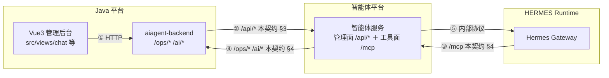

# 接口契约 —— Java 平台 ↔ 智能体平台

> **本契约是《HERMES 智能运维平台完整解决方案》（下称"原方案"）的配套文档。**
> 原方案描述 Java 平台侧（本仓库副本 `platform-solution.md`）；智能体平台侧的实现在 `agent-platform-design.md`。
> **两文冲突时以本契约为准**——本契约晚于原方案，且原方案中已由智能体平台承接的章节（§5.4、§11、§17.4、§24.5）已于本次划转时移出。
>
> **本契约只定义两边的接口面，不描述任何一方的内部实现。**

| 项 | 值 |
|---|---|
| 版本 | v0.1（草案） |
| 状态 | 待双方评审 |
| 变更流程 | 任一方提出 → 双方确认 → 版本号 +0.1，变更记录附于文末 |

---

## 1. 范围与边界

| 方 | 职责 |
|---|---|
| **Java 平台** | 数据面与管理面：日志采集/解析/索引、规则引擎、告警中心、通知中心、Nacos 监听、知识库存储与检索、智能问数语义层、报表生成、用户/权限/部门 |
| **智能体平台** | 智能层：Hermes 运行时接入、受控工具服务、审批、审计、Agent 配置下发、对话编排 |

**本契约定义**：两边之间**全部**的调用接口、身份传递、部署对接、数据归属。

**本契约不定义**：Java 平台内部模块划分；智能体平台内部实现（Hermes 接入方式、工具服务架构、审批机制）。

---

## 2. 总体对接图



**两条跨边界的调用方向**：

- **② Java → 智能体平台**：`/api/*`，Java 前端 → Java 后端 → 我们
- **③④ 双向**：Hermes 调我们的 `/mcp`，我们回头调 Java 的 `/ops/*`

---

## 3. 方向 A · Java 平台 → 智能体平台

### 3.1 通用约定

| 项 | 约定 |
|---|---|
| 认证 | `Authorization: Bearer <平台令牌>`（Java 侧持有，见 §5.2） |
| 链路追踪 | 见 §7.1 |
| 错误返回 | `{"success": false, "errorCode": "...", "errorMessage": "..."}`（对齐原方案 §11.4 信封） |
| 超时 | 普通请求 30s；SSE 长连接不设总超时，靠心跳 |
| 分页 | `?page=1&size=20`，返回 `{total, page, size, items}` |

### 3.2 会话与对话

| 方法 | 路径 | 说明 |
|---|---|---|
| POST | `/api/chat` | 发消息，**SSE 流式**返回 |
| GET | `/api/sessions` | 会话列表 |
| GET | `/api/sessions/{id}/messages` | 历史消息 |
| POST | `/api/sessions/{id}/interrupt` | 停止生成 |
| POST | `/api/sessions/{id}/feedback` | 反馈 👍/👎 + 备注 ⚠️ 原方案 §15.3 有此接口，需定语义 |

**SSE 事件类型**（Java 侧需转发给前端）：

```
message.delta      正文增量
reasoning.delta    思考增量
tool.start         工具调用开始（含工具名）
tool.complete      工具调用结束
citations          证据引用            ⚠️ 新增，见 §7.4
approval.request   审批请求            ← 见 §3.3
approval.cancel    审批撤回（超时）    ← 见 §3.3
message.complete   本轮结束
chat.error         错误
```

### 3.3 审批

**这是本契约里最需要两边对齐语义的一块。**

| 方法 | 路径 | 说明 |
|---|---|---|
| GET | `/api/approvals/pending` | 查询当前挂起的审批（前端刷新后恢复卡片用） |
| POST | `/api/approvals/{requestId}/respond` | 应答 |

**应答体**：

```json
{ "choice": "allow_once | allow_session | allow_always | deny" }
```

**语义约定（双方必须一致）**：

| 约定 | 说明 |
|---|---|
| `choice` 为空 → **按拒绝处理** | 上游协议层的兜底行为，两边都要遵守 |
| 超时 → 渠道撤回 + **工具调用被拒绝** | 撤回 ≠ 拒绝：撤回的是"问客户端"这个动作 |
| 前端**必须**处理 `approval.cancel` | 否则卡片会永远挂着 |
| 审批是**会话级**的 | 卡片必须绑定到对应会话 |

### 3.4 会话查询

供 Java 前端展示会话列表与历史。**会话正文的权威存储在智能体平台侧**（见 §6.1）。

| 方法 | 路径 | 说明 |
|---|---|---|
| GET | `/api/sessions?userId=` | 会话列表（分页） |
| GET | `/api/sessions/{id}/messages` | 历史消息（含工具调用记录与引用） |

⚠️ **待定**：Java 侧是否为会话建本地索引表（见 §6.1）。

### 3.5 Agent 配置

| 方法 | 路径 | 说明 |
|---|---|---|
| GET | `/api/agent-profiles` | 列表 |
| POST | `/api/agent-profiles` | 新建 |
| PUT | `/api/agent-profiles/{id}` | 更新（草稿） |
| POST | `/api/agent-profiles/{id}/publish` | 发布 |
| POST | `/api/agent-profiles/{id}/rollback` | 回滚到指定版本 |
| GET | `/api/agent-profiles/{id}/versions` | 版本历史 |

字段对齐原方案 §11.2：`code / name / description / systemPrompt / modelProvider / modelName / temperature / maxTokens / enabledTools / toolPolicy / timeout / memoryPolicy / knowledgeBaseIds / status / version`。

**密钥只保存引用**，不存明文。

### 3.6 身份与数据范围传递

Java 转发时**必须注入**下列 header，智能体平台据此做权限前置：

| Header | 含义 |
|---|---|
| `X-Actor-User-Id` | 发起人 ID（**不是**模型可影响的字段） |
| `X-Actor-Dept-Ids` | 部门 ID 列表 |
| `X-Data-Scope` | 数据范围（环境 / 项目 / 系统 / 服务，JSON） |
| `X-Actor-Env` | 目标环境（prod / test …） |
| `X-Trace-Id` | 链路 ID |

> ⚠️ **安全要求**：智能体平台**只接受来自 Java 平台地址的**这些 header，其余来源一律忽略并拒绝。这些 header 绝不可由公网直接可达。

---

## 4. 方向 B · 智能体平台 → Java 平台

### 4.1 通用约定

| 项 | 约定 |
|---|---|
| 认证 | Java 侧需支持**服务间调用**：`Authorization: Bearer <服务令牌>` + `X-Actor-*`（同 §3.6） |
| 数据权限 | Java 侧按 `X-Actor-*` 做**行级/字段级**过滤，**不能只做接口级鉴权** |
| 信封 | 对齐原方案 §11.4：请求 `{traceId, userId, tenantId, environment, timeoutMs, dryRun, arguments}`；返回 `{success, data, citations, errorCode, errorMessage, durationMs}` |
| 超时 | 工具侧默认 10s，可单工具覆写 |

> ⚠️ **本节第 2 行是全契约最关键的一条技术要求**：工具调用的发起者是**模型**，不是用户的 HTTP 请求。Java 侧若只做接口级鉴权，会造成**越权**。

### 4.2 工具 ↔ 接口映射表

**命名规则**（对齐 Hermes 的 `mcp__<server>__<tool>`；工具名一律用下划线，全名 ≤ 64 字符）：

| # | 工具名（最终形态） | 等级 | Java 接口 |
|---|---|---|---|
| 1 | `mcp__ops__log_search` | READ | `POST /ops/log/search` |
| 2 | `mcp__ops__log_context` | READ | `GET /ops/log/context/{eventId}` |
| 3 | `mcp__ops__log_aggregate` | READ | `POST /ops/log/aggregate` |
| 4 | `mcp__ops__alert_query` | READ | `GET /ops/alert/page` + `GET /ops/alert/{id}` + `GET /ops/alert/{id}/timeline` |
| 5 | `mcp__ops__alert_acknowledge` | **WRITE** | `POST /ops/alert/{id}/acknowledge` |
| 6 | `mcp__ops__alert_resolve` | **WRITE** | `POST /ops/alert/{id}/resolve` |
| 7 | `mcp__ops__alert_suppress` | **WRITE** | `POST /ops/alert/{id}/suppress` |
| 8 | `mcp__ops__nacos_change_query` | READ | `GET /ops/nacos/change/page` |
| 9 | `mcp__ops__nacos_config_query` | READ | `GET /ops/nacos/config/snapshot` |
| 10 | `mcp__ops__nacos_instance_query` | READ | `GET /ops/nacos/instance/page` |
| 11 | `mcp__ops__knowledge_search` | READ | `POST /ai/knowledge/search` |
| 12 | `mcp__ops__database_metric_query` | READ | ⚠️ **原方案无此接口，需新增**（建议 `POST /ops/metric/query`） |
| 13 | `mcp__ops__report_generate` | **CONTROLLED** | `POST /ops/report/generate` + `GET /ops/report/{id}/download` |
| 14 | `mcp__ops__notification_send` | **CONTROLLED** | ⚠️ **原方案无此接口，需新增**（建议 `POST /ops/notification/send`，带 `source=agent`） |

**分布**：READ 9 · WRITE 3 · CONTROLLED 2。

**FORBIDDEN 类不提供工具**——"修改生产配置"、"执行任意 SQL"不是靠策略拒绝，而是**根本没有这个工具**。

**等级的执行方式**：

| 等级 | 执行方式 |
|---|---|
| READ | 数据范围校验通过即执行 |
| CONTROLLED | 二次确认或特定权限 |
| WRITE | **人工审批**（审批选项：允许一次 / 本次会话 / 始终 / 拒绝） |

### 4.3 逐工具入参

`*` = 必填。**`from`/`to` 强制必填**，对齐原方案 §12.3「强制时间条件和最大查询跨度」。

| 工具 | 入参 |
|---|---|
| `log_search` | `service`*, `environment`, `level`, `keyword`, `traceId`, `from`*, `to`*, `limit` |
| `log_context` | `eventId`*, `before`(默认 5), `after`(默认 5) |
| `log_aggregate` | `service`*, `environment`, `groupBy`(level/service/exceptionType), `from`*, `to`* |
| `alert_query` | `severity`, `status`, `service`, `environment`, `from`, `to`, `limit` |
| `alert_acknowledge` / `resolve` / `suppress` | `alertId`*, `comment` |
| `nacos_change_query` | `namespace`, `group`, `dataId`, `from`*, `to`*, `limit` |
| `nacos_config_query` | `namespace`*, `group`*, `dataId`* |
| `nacos_instance_query` | `service`, `namespace`, `cluster`, `environment` |
| `knowledge_search` | `query`*, `knowledgeBaseIds`, `projectId`, `topK`(默认 5) |
| `database_metric_query` | `metric`*, `dimensions`, `filters`, `from`*, `to`* |
| `report_generate` | `scope`{environment, system, service}, `from`*, `to`*, `format`(md/html/xlsx) |
| `notification_send` | `channel`*, `targets`*, `title`*, `content`* |

**关于信封字段的一个关键说明**：

原方案 §11.4 的信封里含 `traceId` / `userId` / `tenantId` / `environment` / `timeoutMs` / `dryRun`。**这些字段不进工具参数**——MCP 的 `tools/call` 只有业务 `arguments`，上述上下文由**智能体平台从会话上下文补齐**。

**这正是「权限前置」的落地方式：模型无法伪造这些字段，因为它压根传不进来。**

---

### 4.4 出参数据模型

> 本节定义**跨边界返回的数据结构**。字段名以本节为准，两侧实现必须对齐。
> 标 `⚠️` 的是**本契约新增**、原方案未定义的字段，需 Java 侧确认。

#### 4.4.1 公共返回结构

```json
{
  "success": true,
  "data": {},
  "citations": [],
  "errorCode": null,
  "errorMessage": null,
  "durationMs": 200
}
```

**列表类返回统一带分页与截断标记**：

```json
{ "total": 137, "returned": 20, "truncated": true, "items": [] }
```

> ⚠️ **`truncated` 是给模型看的**——它必须知道自己拿到的是不是全部，否则会基于残缺数据下结论。**这个字段不能省。**

#### 4.4.2 日志模型

`log_search` / `log_context` 的 `items[]`（字段对齐原方案 §6.2 标准日志模型）：

| 字段 | 类型 | 来源 |
|---|---|---|
| `eventId` | string | ✅ §6.2 |
| `timestamp` / `ingestTimestamp` | ISO-8601 | ✅ |
| `environment` / `projectCode` | string | ✅ |
| `serviceName` / `instanceId` / `host` | string | ✅ |
| `level` | enum | ✅ DEBUG / INFO / WARN / ERROR |
| `logger` | string | ✅ |
| `traceId` / `spanId` | string | ✅ |
| `message` | string | ✅ |
| `exceptionType` | string | ✅ |
| `durationMs` / `httpStatus` | int | ✅ |
| `labels` | object | ✅ |
| `rawData` | string | ⚠️ **默认不返回**，见下 |

> ⚠️ **`rawData` 建议默认不返回**：原方案 §6.2 有此字段，但它可能含未脱敏内容且体积大。需要时用 `log_context` 按 `eventId` 单独取。

`log_aggregate` 的 `items[]`：`{ "<groupBy 字段名>": …, "count": int }`

#### 4.4.3 告警模型

`alert_query` 的 `items[]`：

| 字段 | 类型 | 来源 |
|---|---|---|
| `alertId` | long | ✅ §14.2 `ops_alert` |
| `fingerprint` | string | ✅ §7.4 |
| `severity` | enum | ✅ §7.5：P0 / P1 / P2 / P3 |
| `status` | enum | ✅ §5.2 状态机：NEW / SUPPRESSED / NOTIFIED / NOTIFY_FAILED / RETRYING / ACKNOWLEDGED / PROCESSING / RESOLVED / CLOSED / REOPENED |
| `ruleCode` / `ruleName` | string | ✅ §7.1 |
| `serviceName` / `environment` | string | ✅ |
| `exceptionType` | string | ✅ §7.4 |
| `title` | string | ⚠️ |
| `occurrenceCount` | int | ✅ §7.4「后续事件累加次数」 |
| `firstOccurredTime` / `lastOccurredTime` | ISO-8601 | ✅ §7.4 |
| `acknowledgedBy` / `acknowledgedTime` | — | ⚠️ |

带时间线时附 `timeline[]`：`{ "time", "action", "actor", "note" }`（✅ §15.2 有 timeline 接口）

#### 4.4.4 Nacos 变更模型

**配置变更**（`nacos_change_query`）：

| 字段 | 说明 |
|---|---|
| `changeId` | ⚠️ |
| `namespace` / `group` / `dataId` | ✅ §9.1 |
| `contentHash` | ✅ §9.1 |
| `changeType` | ⚠️ 新增 / 修改 / 删除 |
| `operator` / `changedAt` | ✅ §9.1 发布人、发布时间 |
| `diff` | ✅ §9.1 **必须是脱敏 Diff** |

**配置快照**（`nacos_config_query`）：`namespace` / `group` / `dataId` / `content` / `contentHash` / `version` / `operator` / `updatedAt`

> ⚠️ **`content` 是否返回全文？** 建议返回，但**由 Java 平台侧完成脱敏**（对齐 §7.2 责任划分）。

**实例变更**（`nacos_instance_query`）：`service` / `cluster` / `ip` / `port` / `instanceId` / `healthy` / `metadata` ✅ §9.1 + `changeType` / `changedAt` ⚠️

#### 4.4.5 知识分块模型

`knowledge_search` 的 `items[]`（对齐原方案 §10.5 知识索引）：

`knowledgeBaseId` / `documentId` / `documentVersion` / `chunkId` / `title` / `headingPath` / `content` / `tags` / `projectId` / `departmentIds` / `environment` / `sourceUri` —— 均 ✅ §10.5

| 新增字段 | 说明 |
|---|---|
| `score` | ⚠️ 检索得分，便于模型判断相关性 |

> ⚠️ **`embedding` 字段不要返回**——向量对模型无意义，且会撑爆上下文。原方案 §10.5 的索引结构里有它，那是**索引侧**的结构，不是**工具返回**的结构。

#### 4.4.6 指标结果模型

`database_metric_query`：

```json
{
  "metric":  { "code": "...", "name": "...", "unit": "..." },
  "range":   { "from": "...", "to": "..." },
  "rows":    [ { "dimension": "value", "value": 123 } ],
  "truncated": false
}
```

> ⚠️ **全部为新增**——原方案 §12 只定义了查询链路与指标定义（§12.2），**未定义结果结构**。

#### 4.4.7 报表模型

`report_generate`：

| 字段 | 说明 |
|---|---|
| `reportId` | ✅ §13.2（MySQL 保存任务） |
| `status` | ⚠️ 生成中 / 完成 / 失败 |
| `summary` | ✅ §13.2 模型生成的摘要 |
| `format` | md / html / xlsx ✅ §13.2 |
| `fileUri` | ✅ §13.2 MinIO 地址 |
| `generatedAt` | ⚠️ |

> ⚠️ **同步还是异步？** 原方案 §13.2 报表落 MinIO、MySQL 存任务——**生成很可能是异步的**，而工具默认超时 10s 明显不够。需定：**同步等待（单独放宽超时）** 还是 **返回任务号 + 轮询**。**建议前者**，对模型最简单。

#### 4.4.8 写操作回执

`alert_acknowledge` / `alert_resolve` / `alert_suppress`：

```json
{ "alertId": 1001, "status": "ACKNOWLEDGED", "actionId": 555, "operatedAt": "..." }
```

`notification_send`：

```json
{ "notificationNo": "N20260929001", "accepted": true, "channel": "feishu" }
```

（`notificationNo` 为幂等键 ✅ §8.3）

> ⚠️ **`accepted` ≠ `delivered`**。原方案 §8.3 的投递是异步的（Outbox → Kafka → Worker → 渠道 API），工具**只能确认"已受理"**。这点必须写进工具描述，否则模型会误报「已发送成功」。**与 4.4.1 的 `truncated` 同一类问题：不能给模型一个会误导它的返回值。**

#### 4.4.9 citations 统一格式

**所有查询类工具必须返回 `citations`**（对齐 §7.4「有证据回答」）：

```json
{
  "kind":    "log | alert | nacos | knowledge | metric | report",
  "source":  "ops-log-alert-2026.09.29",
  "title":   "payment-service ERROR 日志",
  "locator": "01JXXXX",
  "uri":     "可选深链",
  "snippet": "可选摘录"
}
```

| 规则 | 说明 |
|---|---|
| **每条返回数据都要有对应 citation** | 或明确标注「无来源」 |
| `locator` 必须可反查 | Java 平台能据此定位回原始记录（`eventId` / `alertId` / `chunkId`…） |
| **不含未脱敏内容** | citations 会随回答展示给用户 |

#### 4.4.10 错误码

| `errorCode` | 含义 | 期望的模型行为 |
|---|---|---|
| `SCOPE_DENIED` | 数据范围不允许 | 如实告知无权限，不猜测内容 |
| `NOT_FOUND` | 目标不存在 | 如实告知 |
| `INVALID_ARGUMENT` | 参数不合法（含缺时间范围） | 修正参数重试 |
| `TIMEOUT` | 上游超时 | 告知超时，不重试超过一次 |
| `UPSTREAM_ERROR` | Java 侧内部错误 | 告知失败，建议重试 |

> 「被截断」**不用错误码表示**，用 §4.4.1 的 `truncated` 字段——它是正常结果，不是错误。

---

## 5. 部署对接

### 5.1 网络与地址

| 模式 | 地址写法 | 场景 |
|---|---|---|
| **同编排** | 服务名 / 本机回环 | 与 Hermes 同 compose |
| **跨机** | 发布端口 + 路由地址 | Hermes 在另一台 |

**设计约束**：地址必须是**配置项**，不得硬编码。

### 5.2 mcp 端点与认证

| 项 | 约定 |
|---|---|
| 端点 | `POST /mcp`（Streamable HTTP） |
| 监听 | **默认绑回环**；跨机部署时才放开绑定 |
| 认证 | **bearer token**（独立于 §3.1 的平台令牌） |
| token 存放 | 写入 Hermes 的 profile `.env`，配置文件里**只留 header 模板** |
| 轮换 | ⚠️ 待定 |

### 5.3 关于「同编排」下端口暴露的提醒

同编排 + host 网络模式下，容器监听的端口 = 宿主机端口。若宿主机有公网 IP，**该端口可能直接对公网开放**。

**两个措施建议都做**：① 绑定回环；② 强制 bearer 认证。

---

## 6. 数据归属

| 数据 | 权威存储 | 另一侧怎么拿到 |
|---|---|---|
| **6.1 会话正文**（会话、消息、工具调用记录） | **智能体平台**（正文由 Hermes 运行时持久化，由智能体平台统一对外提供查询） | ⚠️ **待定**：Java 侧不建表，改调 §3.4 API？还是建本地索引表？**建议不建表、改调 API**（避免双写与一致性风险） |
| **6.2 审计**（工具调用审计） | **智能体平台** | Java 侧如需展示，调智能体平台 API ⚠️ 接口待补 |
| **6.3 Agent 配置** | **智能体平台** | Java 前端通过 §3.5 读写 |
| **6.4 知识库元数据** | **Java 平台** | 智能体平台只通过 `knowledge_search` 工具调用 |
| **6.5 日志 / 告警 / Nacos / 报表** | **Java 平台** | 同上，只通过工具调用 |

> 原方案 §14.2 列出的 `ai_chat_session` / `ai_chat_message` / `ai_tool_call` / `ai_agent_profile` / `ai_agent_version` 五张表，**随 §11 一并移出原方案**——它们属于智能体平台。
> 原方案保留 `ai_knowledge_*` 系列。

---

## 7. 共同约定

### 7.1 traceId 贯通

| 环节 | 责任 |
|---|---|
| 生成 | **Java 平台**在入口生成（Vue 前端发起时） |
| 传递 | HTTP header `X-Trace-Id` → 智能体平台 → 工具调用 → Java `/ops/*` → 日志 |
| 无 Java 入口的场景 | 智能体平台自生成（如定时报表） |

⚠️ **待定**：header 名、格式、以及 Hermes 内部（Gateway → 工具）如何携带——详见《智能体平台方案》。

### 7.2 脱敏责任划分

对齐原方案 §17.3「写入 OpenSearch **和发送大模型前**脱敏」：

| 侧 | 负责 |
|---|---|
| **Java 平台** | **存储侧**：入库/入索引前脱敏（密码、Token、Cookie、Authorization、手机号、身份证、银行卡、连接串） |
| **智能体平台** | **送模型侧**：工具返回的数据进入大模型上下文前的二次脱敏（**纵深防御，因为模型上下文会把数据带到外部模型服务**） |

**两边都要做，不是二选一。**

### 7.3 里程碑与联调窗口

⚠️ **待定** —— 需对齐原方案 §22 的六阶段排期。

原方案 §22.4 第四阶段才是 HERMES 问答；前三阶段在 Java 侧。本契约涉及的工具接口分布在 §22 各阶段，**建议按阶段分批联调**。

### 7.4 「有证据回答」的实现约定

对齐原方案 §3 原则 7 与 §24.5：

| 环节 | 责任 |
|---|---|
| 生产证据 | **Java 平台**在各个查询接口返回 `citations` 数组（来源、类型、定位） |
| 透传 | **智能体平台**原样透传，不裁剪 |
| 渲染 | **Java 前端**（`src/views/chat`） |

**Java 侧的查询接口必须返回 `citations`** —— 否则「回答必须引用来源」这条无法验收。

---

## 8. 待确认清单

| # | 事项 | 阻塞 |
|---|---|---|
| 1 | **告警动作范围**：原方案 §15.2 有 6 个动作（含 `assign` `close`），§11.3 工具只列 4 个。`assign`/`close` 要不要给模型？ | 建议**先不给** —— `close` 不可逆，风险高于 `resolve` |
| 2 | **`POST /ops/nacos/reconcile`**：接口有、工具无，要不要给？ | 建议不给（运维动作，非查询） |
| 3 | `database_metric_query` 与 `notification_send` 的**接口路径与定义** | **阻塞工具实现** —— 需 Java 侧补 |
| 4 | §6.1 会话归属：Java 侧**建不建**本地索引表 | 阻塞会话列表功能 |
| 5 | §3.2 `/api/sessions/{id}/feedback` 的语义（点赞？标注？回流训练？） | 不阻塞 |
| 6 | §5.2 bearer token 的轮换机制 | 不阻塞 |
| 7 | §7.1 traceId 的具体格式与 header 名 | 不阻塞，但越早定越好 |
| 8 | §4.4.7 **报表同步还是异步**（同步等待需单独放宽工具超时；异步则要任务号+轮询） | **阻塞 `report_generate`** |
| 9 | §4.4.4 **Nacos 配置是否返回全文** | 阻塞字段定义 |
| 10 | §4.4.2 **`rawData` 是否默认不返回** | 安全相关，建议默认不返回 |
| 11 | §4.4.1 `truncated` / §4.4.8 `accepted` 的语义 Java 侧是否认可 | 阻塞工具描述文案 |

---

## 附录 · 原方案章节划转对照

本次划转从原方案移出的内容（**移出即删除，不留重复描述**）：

| 原方案位置 | 内容 | 去向 |
|---|---|---|
| §11 全节 | HERMES Runtime（11 模块 / Agent配置 / 工具清单 / 工具协议 / 安全等级） | 本契约 §4 + 《智能体平台方案》 |
| §5.4 | HERMES 问答 9 步链路 | 《智能体平台方案》 |
| §17.4 | 大模型安全 6 条 | 《智能体平台方案》 |
| §24.5 | HERMES 验收标准 | 《智能体平台方案》 |
| §1.2 | 建设范围中「HERMES 对话、Agent 编排、工具调用和审计」 | 同上 |
| §4.2 | 部署单元 `hermes-runtime` | 本契约 §5 + 《智能体平台方案》 |
| §15.3 | `/ai/chat/*` 五个接口 | 本契约 §3.2 |
| §19.2 | `hermes_*` 六条指标 | 《智能体平台方案》 |
| §14.2 | `ai_chat_*` / `ai_tool_call` / `ai_agent_*` 五张表 | 本契约 §6 |
| §10.1、§13.2 | 「HERMES 负责…」措辞 | 改为 Java 侧主体 |

**划转的执行方式**（已完成于本仓库副本 `platform-solution.md`）：

- **页首加「本副本说明」**：记录来源、原始 md5、配套文档、维护方式
- **5 处章节改为指针**——**保留章节号，不挖空洞**，便于与原文档对照：

| 位置 | 指针指向 |
|---|---|
| §5.4 HERMES问答 | 《智能体平台方案》§4 · 本契约 §3 |
| §11 HERMES Runtime | 本契约 §4.2 / §4.3 · 《智能体平台方案》 |
| §17.4 大模型安全 | 《智能体平台方案》§2 / §6 / §7 |
| §22.4 第四阶段 | 《智能体平台方案》§11 |
| §24.5 HERMES 验收 | 《智能体平台方案》 |

- **其余为条目删除与措辞调整**：§1.2 · §4.2 · §10.1 · §13.2 · §14.2 · §14.3 · §15.3 · §19.2 · §20.1 · §3（原则归属说明）
- 副本仍随原文档更新同步；**原文档为权威来源**
