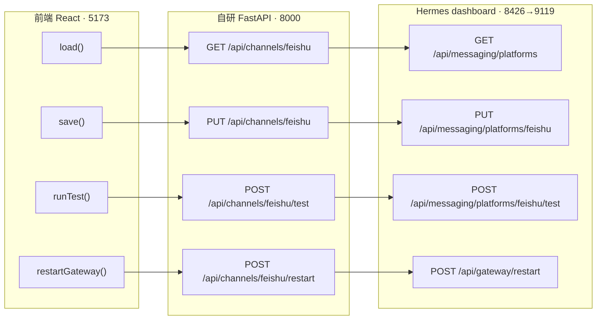
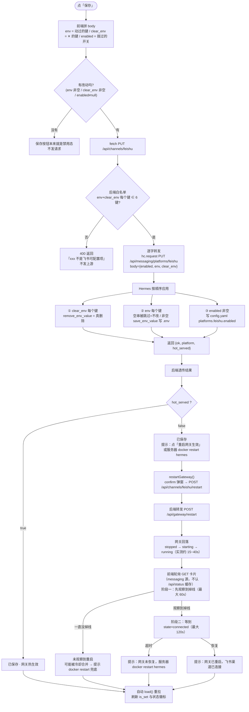

# 消息渠道（飞书）接口链路

> 只讲**接口调用与数据处理**，三跳链路：`浏览器 React(5173) → 自研 FastAPI(8000) → Hermes dashboard(8426→9119)`。
> 实现对应：`backend/channels.py`、`frontend/src/Channels.jsx`。上游语义出处见 CLAUDE.md §4「消息渠道 / 飞书」。
> 定稿：2026-09-28。

## 总览

三条链路全部**不带 `?profile=`**（unscoped）= 管「正在跑的那份网关」的配置。密钥明文**只在「浏览器→自研后端→Hermes 保存」这一瞬间存在**，上游只回 `is_set`/脱敏值，后端错误回显永远不含响应体。

---

## A. 加载 / 刷新（读）

| 步骤 | 动作 |
|---|---|
| 1 🔺 前端 | `Channels.jsx load()` → `fetch("/api/channels/feishu")`（GET，无 body） |
| 2 ⚙️ 后端 | `get_feishu_channel()`：`hc.request("GET", "/api/messaging/platforms")` |
| 3 🔻 Hermes | `GET /api/messaging/platforms`：读当前网关 home 的 `.env` + 网关状态，给每个平台算一张卡 |
| 4 ⚙️ 后端 | 找 `id == "feishu"` 的卡整张返回；找不到→404「不在 Hermes 渠道目录」；上游 ≥400→502（固定文案） |
| 5 🔺 前端 | 存 `card`；重置编辑态（draft/clearSet/enabled=null）；按 `card.state` 渲染徽标、按 `env_vars[*].is_set` 渲染「已配置」 |

**返回卡片字段**（后端原样透传）：
`id / name / description / docs_url / enabled / configured / gateway_running / state / error_code / error_message / updated_at / home_channel / env_vars[] / ingress_url`
- `state`：`connected` / `disabled` / `not_configured` / `pending_restart` / `gateway_stopped` / `startup_failed`
- `env_vars[]` 每项：`key / required / is_set / redacted_value`——**密钥只回脱敏值**（如 `cli_...d00d`），后端全程见不到明文，也不把明文存到任何地方。

---

## B. 保存（写）

**保存落地流程图**（前端点击 → 后端转发 → Hermes 落盘）：

| 步骤 | 动作 | 数据 |
|---|---|---|
| 1 🔺 前端 | `save()` 组 body | `{env: {键:值…}, clear_env: [键…], enabled: 布尔}`； **只放用户动过的字段**：没动的键不进 `env` 也不进 `clear_env`（= 保持原样）；`enabled` 只有开关被拨过才带 |
| 2 ⚙️ 后端 | `update_feishu_channel()` 本地校验 | `env` + `clear_env` 的每个键必须 ∈ 飞书 6 键白名单（APP_ID/APP_SECRET/ENCRYPT_KEY/VERIFICATION_TOKEN/DOMAIN/ALLOWED_USERS），未知键直接 400，**不发上游** |
| 3 ⚙️ 后端 | 逐字透传 | `PUT /api/messaging/platforms/feishu`，body = `{enabled, env, clear_env}` **原样**（`enabled` 未改时为 `null`）；无 `?profile=` |
| 4 🔻 Hermes | 应用 | ① `clear_env` 每个键：`remove_env_value`（真清除）；② `env` 每个键：**空串被 `if trimmed:` 跳过 = 不改**，非空则 `save_env_value` 写入 `.env`；③ `enabled` 非空则写 `config.yaml` 的 `platforms.feishu.enabled` |
| 5 🔻 Hermes | 返回 | `{ok:true, platform:"feishu", hot_served:false}`（单容器模式恒 false=未热生效） |
| 6 ⚙️ 后端 | 返回 | 透传该结果；上游 ≥400→固定文案（400/409/404 保状态码，其余 502） |
| 7 🔺 前端 | 提示 + 重拉 | `hot_served ? "已保存。" : "已保存。点「重启网关生效」加载新配置（或服务器 docker restart hermes）。"`；然后自动 `load()` 刷新 `is_set` 与状态徽标 |

**三态语义（必须分清）**：
- 字段没动 → 不发 → 保持原样
- 字段输入（含空串）→ 进 `env` → 空串被上游跳过 = 不改；要清除只能走第③种
- 字段点「✕ 清除」→ 进 `clear_env` → 上游 `remove_env_value` = 真删除

**写入后生效**：单容器下 PUT 不热生效，需重启网关进程。优先「重启网关生效」按钮（`POST /api/channels/feishu/restart` → `POST /api/gateway/restart`，2026-09-28 真机验证有效：回落约 15~40s 自动回来，全部平台重连）；失败兜底服务器 `docker restart hermes`。

---

## C. 检查状态（只读）

| 步骤 | 动作 |
|---|---|
| 1 🔺 前端 | `runTest()` → `POST /api/channels/feishu/test` |
| 2 ⚙️ 后端 | `test_feishu_channel()` → `POST /api/messaging/platforms/feishu/test`，透传结果 |
| 3 🔻 Hermes | 判定顺序：`enabled?` → `configured?`（缺必填项列出）→ `gateway_running?` → `state=="connected"?` → 有 `error_message?` → 否则「装备齐全但未连接」。**不是真实探活** |
| 4 🔺 前端 | `{ok, state, message}` → 绿「✓」/红「✗」提示 |

---

## 防抖防错要点（后端 `channels.py`）

- **键白名单前置**：未知 env 键在本地就 400，不进上游（防把任意键当 env 写进 `.env`）
- **值不做任何转换**：空串照传——发明者不会把「空串=清除」误写成 OR（上游语序是跳过，这条是保护语义不被翻译错）
- **错误回显不含响应体**：上游错误只带状态码 + 固定文案，密钥/脱敏值永不进错误信息与日志（`channels.py` 不打日志）
- **无 profile 维度**：body 无 `profile` 字段、请求无 `?profile=`