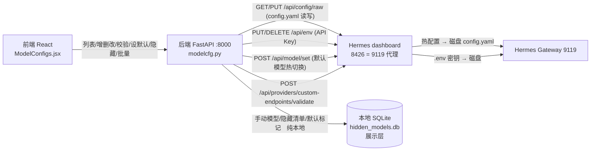
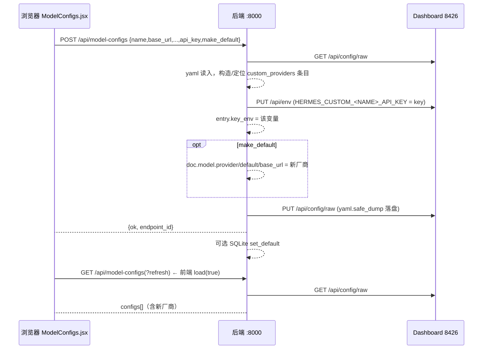
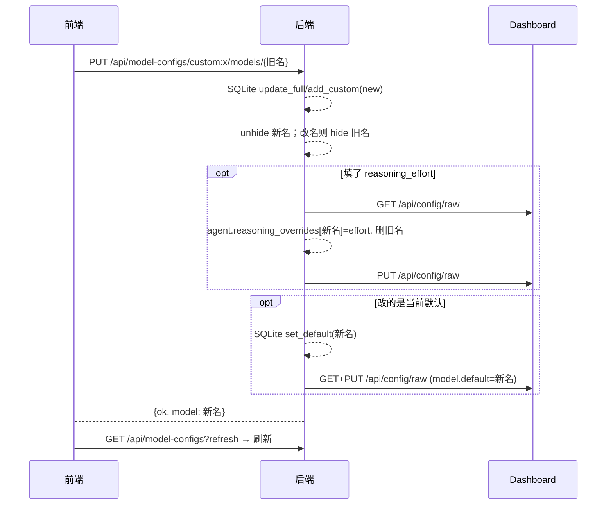
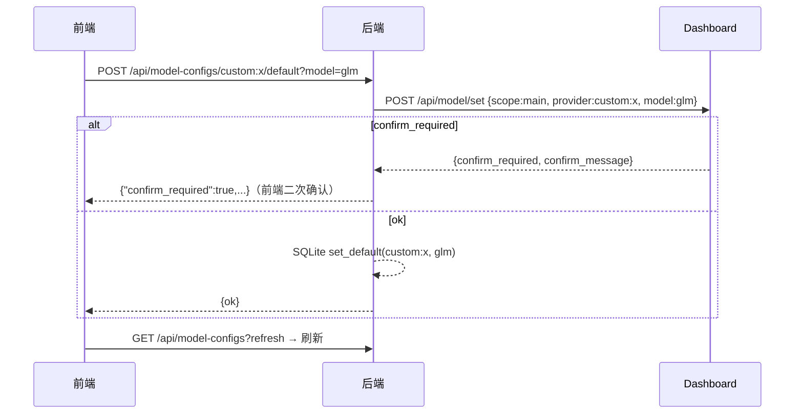

# 模型配置功能链路图（前端 → 后端 → Hermes dashboard → gateway）

> 本文档严格对照当前代码整理（契约以代码为准），覆盖「模型配置」管理页**每个前端功能**调用了哪些后端接口、后端又调用 Hermes dashboard 的哪些接口、数据从哪来、怎么解析。末尾附已知行为/缺口。
> 相关文件：`frontend/src/ModelConfigs.jsx` · `backend/modelcfg.py` · `backend/config.py` · `backend/hidden_store.py`

---

## 0. 一句话总览

```
浏览器 React (ModelConfigs.jsx)
   │  每个操作发 REST 到自有后端 FastAPI :8000 (modelcfg.py)
   ▼
自有后端（只连 dashboard，不碰 gateway / 8642 / /api/pty）
   │  复用 Hermes dashboard 的 REST：config.yaml 读改写、.env 密钥、model/set 热切换、providers validate
   ▼
Hermes dashboard   http://61.184.23.92:8426   （= 服务器上 9119 的公网代理）
   │
   ▼
Hermes Gateway（9119 运行态）  读写 config.yaml 磁盘 / .env

另有本地 SQLite (backend/hidden_models.db)= 我们的「展示层」配置（手动模型 & 隐藏清单 & 默认标记），
不写 Hermes config.yaml——专门规避 models_discovered 厂商清单被自动回写（删了会复活）。
```

---

## 1. 全景图（Mermaid，GitHub 可直接渲染）



---

## 2. 前端功能 → 后端接口 映射表

> 来源：`ModelConfigs.jsx`。路径前缀均为 `/api/model-configs`。

| # | 前端功能 | 触发方式 | 前端函数 | 方法与路径 | 请求体要点 |
|---|---|---|---|---|---|
| 1 | 加载厂商/模型列表 | 挂载 + 「刷新」 | `load(refresh)` | `GET /api/model-configs(?refresh=true)` | — |
| 2 | 新增厂商 | 顶部「＋ 新增厂商」→ 表单保存 | `openCreate()`→`handleSave()` | `POST /api/model-configs` | `{name, base_url, model, api_key?, api_mode?, context_length?, discover_models, make_default}`（`id` 不带 ⇒ 新建） |
| 3 | 编辑厂商 | 厂商行「编辑」→ 表单保存 | `openEdit(c)`→`handleSave()` | `POST /api/model-configs` | 同上 + `id`（= `custom:<name>.lower()`） |
| 4 | 测试连接 | 厂商表单「测试连接」 | `handleValidate()` | `POST /api/model-configs/validate` | `{name, base_url, model, api_key?, api_mode?}` |
| 5 | 删除厂商 | 厂商行「删除」 | `handleDeleteVendor()` | `DELETE /api/model-configs/{id}` | — |
| 6 | 添加模型 | 厂商行「＋ 模型」→ 弹框添加 | `askAddModel(c)`→`handleModelFormConfirm(add)` | `POST /api/model-configs/{vendor}/models` | `{name, display_name?, context_length?, reasoning_effort?}` |
| 7 | 编辑模型（改名/改元数据） | 模型行「编辑」→ 弹框保存 | `askEditModel()`→`handleModelFormConfirm(edit)` | `PUT /api/model-configs/{vendor}/models/{old}` | 同上 |
| 8 | 设默认模型 | 模型行「设默认」 | `handleSwitchModel(c,m)` | `POST /api/model-configs/{vendor}/default?model={m}` | — |
| 9 | 删除单个模型 | 模型行「删除」 | `handleHideModel(c,m)` | `POST /api/model-configs/{vendor}/models/{m}/hide` | — |
| 10 | 批量删除模型 | 勾选 + 「删除所选（N）」 | `handleBatchDelete()` | `POST /api/model-configs/{vendor}/models/hide-batch` | `{models:[...]}` |

> 备注：`api_key` 三态由前端编码——填写=写新 key；清空并勾「清除已保存」→ 发 `api_key:""`；留空不勾 = 字段不出现在 body（= 后端不动）。

---

## 3. 后端接口 → Hermes dashboard 调用（逐条详解，含数据来源/解析）

> 所有 dashboard 访问都经 `HermesClient`（`config.py`）：惰性登录（`POST /auth/password-login`，body 必须 JSON + `provider:"basic"` 拿 cookie）→ 带 cookie 请求；响应 401 会自动重登一次。`backend` 本身默认对前端放行（`APP_AUTH` 不设）。

### 3.1 `GET /api/model-configs` — 组装列表（list_model_configs）
- **数据来源**：dashboard `GET /api/config/raw` → `yaml.safe_load(raw["yaml"])` 得到整份 config 文档 `doc`。
- **解析（厂商）**：`_all_vendor_entries` 合并两段——`custom_providers`（list）逐条 + `providers`（dict）逐条，取 `name/base_url/model/api_mode`。
- **解析（模型）**：每厂商 = `entry.models`（discovery 清单）**∪** SQLite `custom_models`（手动条目，`manual` 元数据优先）→ 过滤出未被 SQLite `hidden_models` 隐藏的。
- **默认模型**：`doc.model.provider` 匹配哪个厂商 slug，`doc.model.default` 为默认模型名；SQLite `get_default()` 兜底。
- **读时副作用**：若 config 的当前默认模型不在 SQLite → 自动 `set_default` 补存一条，保证列表第一条可见。
- **`?refresh=true`**：参数保留兼容，raw 通道本身零缓存，刷新无实际差异。

### 3.2 `POST /api/model-configs` — 新增/编辑厂商（upsert_model_config）
- **读**：`GET /api/config/raw`。
- **定位**：按 `body.id`（`custom:<name>.lower()`）找已存在厂商；找不到 ⇒ 视为新建，append 到 `custom_providers`。
- **字段合并**：`_apply_vendor_fields` 写 `name/base_url/model/api_mode/context_length/discover_models`（merge 语义）。
- **API Key 三态（走 .env 而非 config.yaml）**：
  - 填值 → `PUT /api/env`，key = `HERMES_CUSTOM_<厂商名大写转下划线>_API_KEY`，value = key；并给 entry 写 `key_env` 引用；
  - 空串 → `DELETE /api/env` 清变量，去掉 `key_env`；
  - 缺省 → 不动。
- **设默认勾选**：写 `doc.model.provider/default/base_url`（`make_default`）。
- **保存**：`PUT /api/config/raw`（`_save_doc`：`yaml.safe_dump`）落盘。若设默认 → 同步 SQLite `set_default`。

### 3.3 `POST /api/model-configs/validate` — 测试连接
- 透传 dashboard `POST /api/providers/custom-endpoints/validate`，参数 `{name, base_url, model, api_key?, api_mode?}`，原样返回（`ok:false` 时 `message` 给原因）。

### 3.4 `DELETE /api/model-configs/{vendor}` — 删除厂商（delete_vendor）
- 读 `GET /api/config/raw` → 从 `custom_providers`（list 摘除）或 `providers`（dict 删 key）移除 → `PUT /api/config/raw` 落盘。

### 3.5 `POST /api/model-configs/{vendor}/models` — 添加模型（add_vendor_model）
- **仅 SQLite `add_custom(vendor, name, display_name, context_length, reasoning_effort)`，不调 Hermes 任何接口。**（display_name/context_length/effort 只落本地，规避 discovery 回写。）

### 3.6 `PUT /api/model-configs/{vendor}/models/{old}` — 编辑模型/改名（rename_vendor_model）
- **SQLite**：已有手动条目 → `update_full` 全字段覆盖（空=清空）；无（config/discovery 模型首次编辑）→ `add_custom` 写入手动条目。
- 编辑即关注 → 新名 `unhide`；改名 → 旧名 `hide`（config 侧删不掉，隐藏即从列表消失）。
- **reasoning_overrides（运行时生效）**：若填了 `reasoning_effort` → 读 `GET /api/config/raw` → 写 `doc.agent.reasoning_overrides[新名]=effort`、删旧名 → `PUT /api/config/raw`。
- **默认模型跟随改名**：若改的是当前默认 → SQLite `set_default` + 更新 config `model.default`（`PUT /api/config/raw`）。

### 3.7 `POST /api/model-configs/{vendor}/default?model=` — 设默认（set_default_model）
- dashboard `POST /api/model/set`，body `{scope:"main", provider:vendor_id, model}`（模型目录上核实过 slug）。
- 返回 `confirm_required` 时透传给前端要确认（昂贵模型）。
- 成功 → 同步 SQLite `set_default`（列表第一条的依据）。

### 3.8 `POST .../models/{m}/hide` × 1 或 `hide-batch` — 删除模型（隐藏）
- **仅 SQLite `hide_model`**（`INSERT OR IGNORE INTO hidden_models`），不写 Hermes。批量即逐项幂等 hide。

### 3.9 存在但当前前端未用到的后端接口
- `POST .../{vendor}/activate`：写 config `model` 段并落盘（历史入口，UI 已去掉该按钮）。
- `DELETE .../models/{model}`：硬删 SQLite 条目（与 hide 语义不同，前端当前走 hide）。
- `POST .../models/{m}/unhide`：恢复隐藏（预留）。

---

## 4. 数据来源与解析一览（谁住哪）

| 数据 | 存储位置 | 读 | 写 | 我们的解析 |
|---|---|---|---|---|
| 厂商接入（name/base_url/model/api_mode/discover） | Hermes **config.yaml** `custom_providers[]` + `providers{}` | `GET /api/config/raw` → yaml | `PUT /api/config/raw`（yaml.safe_dump） | `_all_vendor_entries` 合并两段 |
| API Key | Hermes **.env**（`HERMES_CUSTOM_<NAME>_API_KEY`），config 只留 `key_env` 引用 | 回读只有 preview | `PUT/DELETE /api/env` | key_env 规则复刻官方 |
| 默认模型 | config `model.{provider,default,base_url}` + SQLite 标记 | `doc.model` | `POST /api/model/set`（热切换）/ 写 config | SQLite `is_default=1` 置顶 |
| 手动模型元数据 | **SQLite `custom_models`**（display_name/context_length/effort） | `list_manual` | `add_custom/update_full/rename_custom/delete_custom` | 与 discovery 模型按名合并，manual 优先 |
| 隐藏清单 | **SQLite `hidden_models`** | `hidden_set` | `hide_model/unhide_model` | 列表过滤掉 |
| 思考等级运行时 | config `agent.reasoning_overrides` | `GET /api/config/raw` | `PUT /api/config/raw` | **仅编辑(rename)路径写，add 不写** |

---

## 5. 对 Hermes Gateway 的操作说明（是什么、做了什么、哪些不做）

- **dashboard = Hermes 的 HTTP 面**：8426 是服务器 9119（dashboard 端口）的公网代理。我们后端**只连 dashboard**，从不直接碰 gateway 内部、`tui_gateway`、`/api/pty`（TUI 字节流）或 8642（OpenAI 兼容口）——这是用户的硬约束。
- **config.yaml 读改写** → 本质是改 Hermes 的持久配置；**Gateway 运行态 watch 磁盘 config**，故写 `config/raw` 或 `model/set` 会反映到运行时；`agent.reasoning_overrides` 由官方 `resolve_reasoning_config` 单一收口实现思考等级运行时生效。
- **`.env` 密钥** → `PUT/DELETE /api/env` 由 Hermes 管理 .env 文件与注入，密钥不落 config.yaml 明文。
- **`model/set`（scope:"main"）** → gateway 热切换全局默认模型，返回可能带 `confirm_required`。
- 认证链路：后端 `requests.Session` 经 `POST /auth/password-login` 拿 cookie（会话 TTL 12h，刷新 30d）；dashboard 重启 = 会话失效，`HermesClient` 在 401 时自动重登一次。

---

## 6. 关键操作端到端时序（Mermaid sequenceDiagram）

### 6.1 新增厂商（含填 API Key + 勾设默认）


### 6.2 编辑模型改名 / 设思考等级


### 6.3 设默认模型


---

## 7. 已知行为 / 缺口（按当前代码如实记录）

- **添加模型时填的「思考等级」不会运行时生效**：`add_vendor_model` 只写 SQLite，**不写 `agent.reasoning_overrides`**；只有**编辑（rename）路径**会写并生效。若希望「+模型 填思考等级即生效」，需在 add 路径补齐 overrides 写入。
- **`activate` 端点存在但前端未调用**：当前「激活/设默认」统一走 `default?model=`（`model/set`）。
- **列表读有写副作用**：`GET` 默认兜底会把 config 默认模型补存进 SQLite（一次性建默认标记）。
- **前端 load 对 5xx 自动重试（2 次，0.5s/1s）** 吸收 dashboard 瞬时抖动（实测偶发 502）。
- **dashboard 瞬时 502 / 会话过期**：认证走 `HermesClient` 401 自动重登；`/api/config/raw` 读改写对 gateway 未重启时不丢状态，但 dashboard 重启会清会话（未配固定 secret 时）。
```